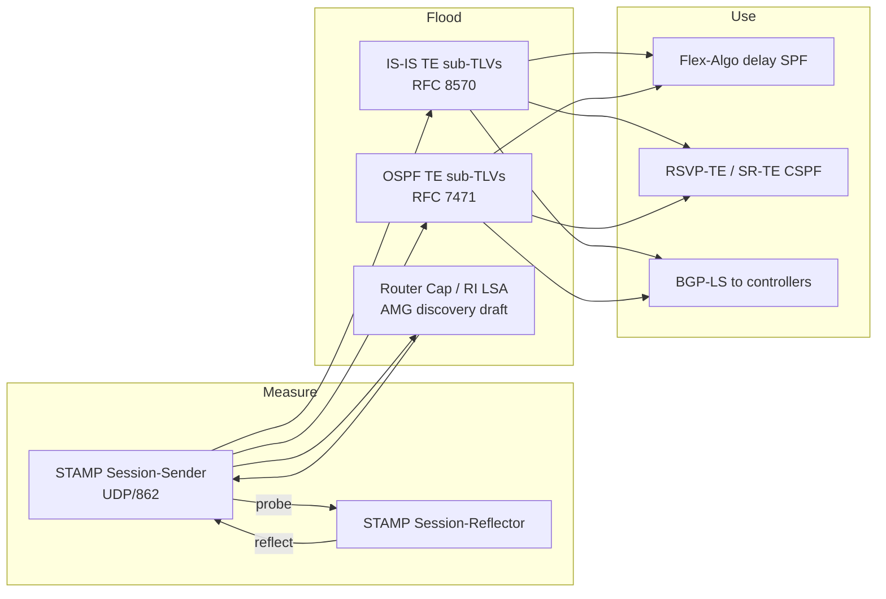

# Integrating STAMP with IS-IS and OSPF

STAMP is **not** carried inside IS-IS or OSPF packets. The IGP stays the distributor; STAMP stays the UDP probe. Integration is: **measure with STAMP, then flood the results (and optionally the session endpoints) in the IGP**.

There are three layers. You can deploy A today; B is the IETF discovery work; C is how routing actually uses the numbers.

**Current BGP-LS implementation status (2026-09-16):** IS-IS performance attributes are translated into the local BGP-LS RIB, including RFC 8571 TLVs 1114–1120 and application-specific attributes in RFC 9294 TLV 1122. Transmission to external BGP-LS peers remains unimplemented: [`route_bgpls_originate`](../../zebra-rs/src/bgp/route.rs) stores locally originated routes but defers re-advertisement. Delivery to a PCE or controller is therefore still unverified. The BDD topology exercises remote IS-IS flooding and local BGP-LS translation; it does not verify BGP UPDATE delivery. The architecture below describes the intended integration. See the [BGP-LS review](../reviews/bgp-ls-te-performance-2026-09-16.md) for validation details.

## Architecture



---

## Pattern A — Link PM feeding IGP TE metrics (what operators run today)

This is the production integration. Each router runs a **per-adjacency STAMP session** against the neighbor’s **link address** (not a loopback — otherwise you measure a path, not that link). Hardware timestamps are preferred. One-way delay needs PTP/NTP; without it, use half of RTT only as an approximation.

The Session-Sender computes delay / min-max delay / delay variation / loss, then the IGP advertises those values as **unidirectional, forward-path** link attributes.

| Metric | IS-IS (RFC 8570) | OSPF (RFC 7471) | Notes |
|---|---|---|---|
| Average unidirectional delay | sub-TLV **33** | sub-TLV **27** | microseconds, 24-bit |
| Min/Max unidirectional delay | sub-TLV **34** | sub-TLV **28** | Flex-Algo uses **min** delay |
| Delay variation | sub-TLV **35** | sub-TLV **29** | |
| Unidirectional link loss | sub-TLV **36** | sub-TLV **30** | |
| Residual / available / utilized BW | 37 / 38 / 39 | 31 / 32 / 33 | not from STAMP |

Carriers:

- **IS-IS:** Extended IS Reachability TLV 22 (also 141, 222, 223)
- **OSPFv2:** TE Opaque LSA, Link TLV
- **OSPFv3:** Intra-Area-TE-LSA, Link TLV
- **Application-specific:** ASLA (RFC 8919 / RFC 8920) so Flex-Algo, RSVP-TE, and SR-MPLS can take different attributes from the same link

RFC 8570/7471 **do not** specify the probe protocol. Juniper still documents TWAMP-Light for this; STAMP ([RFC 8762](https://datatracker.ietf.org/doc/html/rfc8762) + [RFC 8972](https://datatracker.ietf.org/doc/html/rfc8972)) is the interoperable replacement. Unauthenticated STAMP can interwork with TWAMP Light.

### Advertisement hygiene (this is what keeps the LSDB stable)

1. **Filter** samples (rolling average). RFC 8570 says delay **should not** include queuing — measure in a class with little queue delay, or sum component-link delays for bundled/FA links.
2. **Periodic** re-advertise on a timer (often ~120s) only if the value moved by more than a **percentage threshold**.
3. **Accelerated** advertise on a large jump (optional).
4. Set the **Anomalous (A) bit** when delay/loss crosses an upper threshold; clear it only after a reuse threshold holds for one or more intervals.
5. On A-bit, OSPF/IS-IS can **raise IGP or TE cost** so SPF/CSPF leave the link (Cisco `cost-fallback anomaly delay`).

For LAG members, use STAMP micro-sessions ([RFC 9534](https://datatracker.ietf.org/doc/html/rfc9534)) so each member is measured separately.

---

## Pattern B — IGP auto-discovery of STAMP endpoints (emerging)

Today session targets are static or NMS-driven. [draft-admnr-lsr-igp-measurement-group-04](https://datatracker.ietf.org/doc/draft-admnr-lsr-igp-measurement-group/04/) (updated 11 Sep 2026, individual, not yet WG) adds **Active Measurement Groups (AMGs)** for TWAMP/STAMP, modeled on S-BFD discriminators ([RFC 7883](https://datatracker.ietf.org/doc/html/rfc7883) / [RFC 7884](https://datatracker.ietf.org/doc/html/rfc7884)).

An AMG is: one AMP, one address family, one Group ID (1–65534), and a set of IP endpoints. STAMP parameters (UDP port, interval) stay in **local config**, keyed by Group ID — they are **not** flooded.

**IS-IS:** AMP Measurement Group **sub-TLV** in Router CAPABILITY **TLV 242**, **S flag set** (domain-wide). Length 6 (IPv4) or 18 (IPv6).

```
 Type | Length | Group ID | IPv4/IPv6 endpoint
```

**OSPFv2/v3:** AMP Measurement Group **TLV** in Router Information LSA ([RFC 7770](https://datatracker.ietf.org/doc/html/rfc7770)), **AS-scoped** (plus area-scoped copies into stub/NSSA). Length 8 (IPv4) or 20 (IPv6).

```
 Type | Length | Group ID | Reserved | IPv4/IPv6 endpoint
```

**BGP-LS:** node-attribute TLV so a controller can discover AMG members across IGP domains.

**Session bootstrap:**

1. Router advertises `(Group ID, endpoint)` for each AMG it joins.
2. Peers with the same Group ID and same address family form a STAMP session.
3. If both sides start, the **higher IP** wins (octet-string compare).
4. Tear down if the advertiser is no longer IGP-reachable.
5. Membership changes **must not** trigger SPF.

Use **physical-interface addresses** for Pattern A link delay. Use **loopbacks** for mesh / end-to-end / SR-path sessions. Distinct Group IDs for STAMP vs TWAMP, and for IPv4 vs IPv6.

---

## Pattern C — What consumes the flooded metrics

| Consumer | How it uses STAMP-derived IGP data |
|---|---|
| **Flex-Algo** ([RFC 9350](https://datatracker.ietf.org/doc/html/rfc9350)) | Metric-type **Min Unidirectional Link Delay**. Delay Flex-Algo is the usual reason to do Pattern A. |
| Flex-Algo + loss | [draft-ietf-lsr-flex-algo-link-loss](https://datatracker.ietf.org/doc/html/draft-ietf-lsr-flex-algo-link-loss) excludes links over a loss threshold (STAMP/TWAMP as the measurement). |
| RSVP-TE / SR-TE CSPF | Delay, loss, bandwidth as constraints |
| BGP-LS ([RFC 8571](https://datatracker.ietf.org/doc/html/rfc8571) / [RFC 9552](https://datatracker.ietf.org/doc/html/rfc9552)) | Export to PCE/controller |
| SR path PM | [RFC 9503](https://datatracker.ietf.org/doc/html/rfc9503) + [draft-ietf-spring-stamp-srpm](https://datatracker.ietf.org/doc/html/draft-ietf-spring-stamp-srpm-19): STAMP over IGP best path or Flex-Algo using Prefix-SIDs / SRv6 locators and Return Path TLV 10 |

Path PM is the reverse of Pattern A: IGP/SR **define** the path STAMP follows; results usually go to telemetry, not back into the IGP (putting path delay into a **link** TE sub-TLV would be wrong).

---

## Practical build order

1. **Clock:** PTP on every node if you need one-way delay.
2. **Reflector:** STAMP Session-Reflector on UDP 862 (or a private port) on every interface you will measure.
3. **Link sessions:** one Session-Sender per IGP adjacency, sourced/destined at link IPs, DSCP that avoids queues.
4. **Map results** into RFC 8570 / RFC 7471 (ASLA if you run Flex-Algo).
5. **Thresholds:** periodic + accelerated + A-bit, so probes do not become LSP/LSA storms.
6. **Flex-Algo** with min-delay metric, or export via BGP-LS.
7. **Optional:** AMG advertisements once the measurement-group draft (or vendor equivalent) is implemented, so loopback meshes do not need NMS session lists.

STAMP never becomes an IS-IS/OSPF TLV. The IGP either **carries STAMP’s output** (delay/loss) or **carries STAMP’s targets** (AMG membership). Keep those two advertisements separate: metrics on **links**, discovery on **nodes**.

---

## References

- [RFC 8762](https://datatracker.ietf.org/doc/html/rfc8762) — Simple Two-Way Active Measurement Protocol (STAMP)
- [RFC 8972](https://datatracker.ietf.org/doc/html/rfc8972) — STAMP Optional Extensions
- [RFC 8570](https://datatracker.ietf.org/doc/html/rfc8570) — IS-IS TE Metric Extensions
- [RFC 7471](https://datatracker.ietf.org/doc/html/rfc7471) — OSPF TE Metric Extensions
- [RFC 7770](https://datatracker.ietf.org/doc/html/rfc7770) — OSPF Router Information LSA
- [RFC 7883](https://datatracker.ietf.org/doc/html/rfc7883) / [RFC 7884](https://datatracker.ietf.org/doc/html/rfc7884) — S-BFD discriminator advertisement (model for AMG)
- [RFC 8919](https://datatracker.ietf.org/doc/html/rfc8919) / [RFC 8920](https://datatracker.ietf.org/doc/html/rfc8920) — IS-IS / OSPF Application-Specific Link Attributes
- [RFC 9350](https://datatracker.ietf.org/doc/html/rfc9350) — IGP Flexible Algorithm
- [RFC 9503](https://datatracker.ietf.org/doc/html/rfc9503) — STAMP Extensions for Segment Routing Networks
- [RFC 9534](https://datatracker.ietf.org/doc/html/rfc9534) — STAMP Extensions for Latency Measurement on LAG
- [RFC 8571](https://datatracker.ietf.org/doc/html/rfc8571) / [RFC 9552](https://datatracker.ietf.org/doc/html/rfc9552) — BGP-LS TE metrics / distribution
- [draft-admnr-lsr-igp-measurement-group-04](https://datatracker.ietf.org/doc/draft-admnr-lsr-igp-measurement-group/04/) — Advertising IGP Active Measurement Groups
- [draft-ietf-spring-stamp-srpm](https://datatracker.ietf.org/doc/html/draft-ietf-spring-stamp-srpm-19) — STAMP Performance Measurement in SR Networks
- [draft-ietf-lsr-flex-algo-link-loss](https://datatracker.ietf.org/doc/html/draft-ietf-lsr-flex-algo-link-loss) — Flex-Algo exclude maximum link loss
