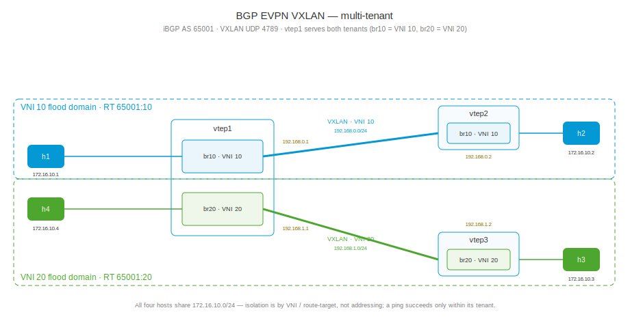

# BGP EVPN VXLAN multi-tenant (IPv4 transport)

This playset extends [bgp-evpn-vxlan4](../bgp-evpn-vxlan4/README.md) to two
tenants. Three VTEPs stretch two independent L2 segments over the same IPv4
underlay: VNI 10 connects `h1` (behind `vtep1`) and `h2` (behind `vtep2`),
VNI 20 connects `h3` (behind `vtep3`) and `h4` (behind `vtep1`). `vtep1` is
the multi-tenant VTEP — it serves both VNIs at once.

All four hosts deliberately share the same IP subnet (`172.16.10.0/24`).
That is the point of the demo: hosts in different VNIs can even use
overlapping address space and still never see each other. Isolation comes
from the VNI, not from addressing — pings work inside a tenant and fail
across tenants because the ARP broadcast never leaves the tenant's
flood domain.



## Bring up all nodes

``` shell
$ ./up.sh
bring up
...
apply config: h3
applied
apply config: h4
applied
```

## The multi-tenant VTEP configuration

`vtep1.yaml` carries both tenants — two bridges, two VXLAN devices, and a
BGP session toward each remote VTEP:

``` yaml
interface:
- if-name: vtep1-vtep2
  ipv4:
    address: 192.168.0.1/24
- if-name: vtep1-vtep3
  ipv4:
    address: 192.168.1.1/24
- if-name: vtep1-h1
  bridge: br10
- if-name: vtep1-h4
  bridge: br20
system:
  hostname: vtep1
bridge:
- name: br10
- name: br20
vxlan:
- name: vxlan10
  vni: 10
  local-address: 192.168.0.1
  bridge: br10
- name: vxlan20
  vni: 20
  local-address: 192.168.1.1
  bridge: br20
router:
  bgp:
    global:
      as: 65001
      router-id: 192.168.0.1
    afi-safi:
    - name: evpn
      advertise-all-vni: true
    neighbor:
    - remote-address: 192.168.0.2
      enabled: true
      remote-as: 65001
      afi-safi:
      - name: ipv4
        enabled: true
      - name: evpn
        enabled: true
    - remote-address: 192.168.1.2
      enabled: true
      remote-as: 65001
      afi-safi:
      - name: ipv4
        enabled: true
      - name: evpn
        enabled: true
```

Each tenant is one `bridge` + `vxlan` pair: the host-facing port and the
VXLAN device are enslaved to the tenant's bridge, and nothing connects the
two bridges. The daemon creates every VXLAN device in the kernel's modern
`external` + `vnifilter` (single-VXLAN-device) mode and programs the
per-bridge VLAN→VNI tunnel mapping automatically. `vnifilter` is exactly
what lets several such devices share UDP port 4789 in one namespace: on
receive, the kernel demultiplexes each incoming VNI to the device that has
that VNI registered.

`vtep2.yaml` (VNI 10 only) and `vtep3.yaml` (VNI 20 only) are single-tenant
VTEPs, identical in shape to the base playset. The hosts are one address
each — note h1/h3 are in *different* tenants despite the same subnet:

``` yaml
interface:
- if-name: h3-vtep3
  ipv4:
    address: 172.16.10.3/24
system:
  hostname: h3
```

## One BGP table, two tenants

`vtep1` holds both sessions and both tenants' EVPN routes. The
route-target — auto-derived from the VNI — is what keeps them apart:
VNI 10 routes carry `RT:65001:10`, VNI 20 routes `RT:65001:20`, under
per-VNI route distinguishers:

``` shell
$ sudo ip netns exec vtep1 vty
vtep1>show bgp summary
...
L2VPN EVPN Summary:
BGP router identifier 192.168.0.1, local AS number 65001 VRF default vrf-id 0
RIB entries 8
Peers 2

Neighbor        V         AS   MsgRcvd   MsgSent   TblVer  InQ OutQ  Up/Down State       PfxRcd/Snt Hostname
192.168.0.2     4      65001         6         3        0    0    0 00:00:41 Established        2/4 s
192.168.1.2     4      65001         6         3        0    0    0 00:00:41 Established        2/4 s
vtep1>show bgp evpn
...
   Network          Next Hop            Metric LocPrf Weight Path
Route Distinguisher: 192.168.0.1:10
 *>  [2]:[0]:[48]:[2e:7e:8f:dd:f9:d2]
                    192.168.0.1                0         32768 i
                    Extended community: RT:65001:10 ET:8
 *>  [2]:[0]:[48]:[e6:92:22:fd:81:6c]
                    192.168.0.1                0         32768 i
                    Extended community: RT:65001:10 ET:8
 *>  [3]:[0]:[32]:[192.168.0.1]
                    192.168.0.1                0         32768 i
                    Extended community: RT:65001:10 ET:8
                    PMSI: ingress-replication endpoint:192.168.0.1 vni:10
Route Distinguisher: 192.168.0.1:20
 *>  [2]:[0]:[48]:[6e:40:62:e9:44:eb]
                    192.168.1.1                0         32768 i
                    Extended community: RT:65001:20 ET:8
 *>  [2]:[0]:[48]:[a2:2d:9f:3b:05:bf]
                    192.168.1.1                0         32768 i
                    Extended community: RT:65001:20 ET:8
 *>  [3]:[0]:[32]:[192.168.1.1]
                    192.168.1.1                0         32768 i
                    Extended community: RT:65001:20 ET:8
                    PMSI: ingress-replication endpoint:192.168.1.1 vni:20
Route Distinguisher: 192.168.0.2:10
 *>  [2]:[0]:[48]:[32:7d:0a:59:c1:e8]
                    192.168.0.2                0    100      0 i
                    Extended community: RT:65001:10 ET:8
 *>  [2]:[0]:[48]:[52:6b:a1:c5:ce:b6]
                    192.168.0.2                0    100      0 i
                    Extended community: RT:65001:10 ET:8
 *>  [3]:[0]:[32]:[192.168.0.2]
                    192.168.0.2                0    100      0 i
                    Extended community: RT:65001:10 ET:8
                    PMSI: ingress-replication endpoint:192.168.0.2 vni:10
Route Distinguisher: 192.168.1.2:20
 *>  [2]:[0]:[48]:[2e:d0:aa:15:22:89]
                    192.168.1.2                0    100      0 i
                    Extended community: RT:65001:20 ET:8
 *>  [2]:[0]:[48]:[6e:7d:af:fb:fb:2b]
                    192.168.1.2                0    100      0 i
                    Extended community: RT:65001:20 ET:8
 *>  [3]:[0]:[32]:[192.168.1.2]
                    192.168.1.2                0    100      0 i
                    Extended community: RT:65001:20 ET:8
                    PMSI: ingress-replication endpoint:192.168.1.2 vni:20
```

Two details worth noticing:

* Four route distinguishers: `vtep1` originates under both `192.168.0.1:10`
  and `192.168.0.1:20`; `vtep2` contributes only `:10`, `vtep3` only `:20`.
* Per-VNI VTEP endpoints — the next hop and the ingress-replication PMSI
  endpoint of `vtep1`'s VNI 20 routes are `192.168.1.1` (the `vxlan20`
  `local-address`, facing `vtep3`), while its VNI 10 routes use
  `192.168.0.1`. Each tenant's tunnel rides the right underlay link.

## Kernel view: two tenants, two flood domains

``` shell
vtep1>bridge vni
dev               vni                group/remote
vxlan10           10
vxlan20           20
vtep1>bridge vlan tunnelshow
port              vlan-id    tunnel-id
vxlan10           1          10
vxlan20           1          20
vtep1>bridge fdb show dev vxlan10
32:7d:0a:59:c1:e8 vlan 1 extern_learn master br10
52:6b:a1:c5:ce:b6 vlan 1 extern_learn master br10
e6:bb:84:2e:db:ff vlan 1 master br10 permanent
32:7d:0a:59:c1:e8 dst 192.168.0.2 vni 10 src_vni 10 self extern_learn permanent
00:00:00:00:00:00 dst 192.168.0.2 vni 10 src_vni 10 self extern_learn permanent
52:6b:a1:c5:ce:b6 dst 192.168.0.2 vni 10 src_vni 10 self extern_learn permanent
vtep1>bridge fdb show dev vxlan20
2e:d0:aa:15:22:89 vlan 1 extern_learn master br20
6e:7d:af:fb:fb:2b vlan 1 extern_learn master br20
0a:86:f5:18:6c:e4 vlan 1 master br20 permanent
6e:7d:af:fb:fb:2b dst 192.168.1.2 vni 20 src_vni 20 self extern_learn permanent
00:00:00:00:00:00 dst 192.168.1.2 vni 20 src_vni 20 self extern_learn permanent
2e:d0:aa:15:22:89 dst 192.168.1.2 vni 20 src_vni 20 self extern_learn permanent
```

`vxlan10`'s remote entries — including the all-zeros BUM flood entry built
from `vtep2`'s Type-3 IMET — all point at `192.168.0.2`; `vxlan20`'s all
point at `192.168.1.2`. Each VLAN 1 → VNI mapping lives inside its own
bridge (VLAN IDs are scoped per bridge), so the two tenants share nothing:
not a MAC table, not a flood list, not a tunnel endpoint.

## Intra-tenant: both segments forward

``` shell
$ sudo ip netns exec h1 ping 172.16.10.2      # VNI 10: h1 -> h2
64 bytes from 172.16.10.2: icmp_seq=1 ttl=64 time=0.051 ms
64 bytes from 172.16.10.2: icmp_seq=2 ttl=64 time=0.192 ms

$ sudo ip netns exec h3 ping 172.16.10.4      # VNI 20: h3 -> h4
64 bytes from 172.16.10.4: icmp_seq=1 ttl=64 time=0.077 ms
64 bytes from 172.16.10.4: icmp_seq=2 ttl=64 time=0.083 ms
```

`ttl=64` on both — each tenant is one flat L2 segment. On the wire, the
h3↔h4 traffic rides the `vtep1`–`vtep3` link inside VNI 20:

``` shell
vtep1>tcpdump -nli vtep1-vtep3 udp port 4789
11:08:46.268689 IP 192.168.1.2.39171 > 192.168.1.1.4789: VXLAN, flags [I] (0x08), vni 20
IP 172.16.10.3 > 172.16.10.4: ICMP echo request, id 55258, seq 2, length 64
11:08:46.268739 IP 192.168.1.1.39171 > 192.168.1.2.4789: VXLAN, flags [I] (0x08), vni 20
IP 172.16.10.4 > 172.16.10.3: ICMP echo reply, id 55258, seq 3, length 64
```

## Cross-tenant: nothing forwards

Every pairing between the tenants fails — h1/h2 (VNI 10) can reach neither
h3 nor h4 (VNI 20), even though all four believe they share
`172.16.10.0/24`:

``` shell
$ sudo ip netns exec h1 ping -c 3 -W 1 172.16.10.3
PING 172.16.10.3 (172.16.10.3) 56(84) bytes of data.

--- 172.16.10.3 ping statistics ---
3 packets transmitted, 0 received, 100% packet loss, time 613ms
```

(same for h1→h4, h2→h3, h2→h4)

The failure mode is the interesting part — the ping dies at ARP. h1's
neighbor table resolves its VNI 10 peer but never gets an answer from the
VNI 20 hosts:

``` shell
$ sudo ip netns exec h1 ip neigh show dev h1-vtep1
172.16.10.3 INCOMPLETE
172.16.10.2 lladdr 32:7d:0a:59:c1:e8 STALE
172.16.10.4 FAILED
```

h1's ARP broadcast enters `br10` and floods along VNI 10's ingress
replication list — which contains only VNI 10 VTEPs. It reaches h2 and
nobody else. h4 sits one namespace away on the very same `vtep1`, but on
`br20`; with no interface, route, or VLAN shared between the bridges and
distinct route-targets in BGP, there is no path — exactly the property
that lets a provider run overlapping tenant address space on shared
VTEPs and a shared underlay.

## Tear down

``` shell
$ ./down.sh
```

## Appendix: Addresses

| node  | role             | underlay       | overlay (tenant)        |
|:------|:-----------------|:---------------|:------------------------|
| vtep1 | VTEP, both VNIs  | 192.168.0.1/24, 192.168.1.1/24 | —       |
| vtep2 | VTEP, VNI 10     | 192.168.0.2/24 | —                       |
| vtep3 | VTEP, VNI 20     | 192.168.1.2/24 | —                       |
| h1    | host             | —              | 172.16.10.1/24 (VNI 10) |
| h2    | host             | —              | 172.16.10.2/24 (VNI 10) |
| h3    | host             | —              | 172.16.10.3/24 (VNI 20) |
| h4    | host             | —              | 172.16.10.4/24 (VNI 20) |

VXLAN UDP 4789, iBGP AS 65001. Per-VNI RD `<router-id>:<vni>`; RT
`65001:<vni>` (auto-derived from the VNI) — `RT:65001:10` vs `RT:65001:20`
is the control-plane tenant boundary.
