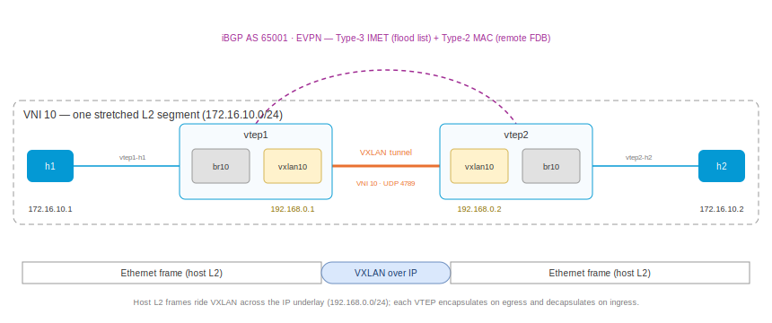

# BGP EVPN VXLAN (IPv4 transport)

This playset demonstrates BGP EVPN with a VXLAN data plane: two VTEPs
stretch one L2 segment across an IPv4 underlay (VXLAN over UDP/IPv4), with BGP's EVPN address
family (RFC 7432 / RFC 8365) as the control plane — Type-3 IMET routes
build the BUM flood list and Type-2 MAC routes populate the remote FDB, so
no flood-and-learn runs over the tunnel. Two hosts on the same IP subnet,
each behind a different VTEP, talk as if they shared a switch.



Each VTEP runs zebra-rs with a bridge (`br10`), a VXLAN device
(`vxlan10`, VNI 10) enslaved to it, and the host-facing interface enslaved
alongside. zebra-rs drives the whole kernel datapath: it creates the
devices, enslaves them, and programs the single-VXLAN-device forwarding
plumbing (VLAN-aware bridge, per-port tunnel mapping) plus every FDB entry
— the kernel's own MAC learning is disabled on the tunnel port
(`learning off`); BGP owns the table.

## Bring up all nodes

``` shell
$ ./up.sh
bring up
...
apply config: h2
applied
```

## Take a look at the YAML configuration

`vtep1.yaml` — the entire VTEP definition:

``` yaml
interface:
- if-name: vtep1-vtep2
  ipv4:
    address: 192.168.0.1/24
- if-name: vtep1-h1
  bridge: br10
system:
  hostname: vtep1
bridge:
- name: br10
vxlan:
- name: vxlan10
  vni: 10
  local-address: 192.168.0.1
  bridge: br10
router:
  bgp:
    global:
      as: 65001
      router-id: 192.168.0.1
    afi-safi:
    - name: evpn
      advertise-all-vni: true
    neighbor:
    - remote-address: 192.168.0.2
      enabled: true
      remote-as: 65001
      afi-safi:
      - name: ipv4
        enabled: true
      - name: evpn
        enabled: true
```

Three pieces build the L2 service:

* `bridge br10` + `interface vtep1-h1 bridge br10` — the local switch and
  its access port.
* `vxlan vxlan10 vni 10 local-address ... bridge br10` — the VTEP. The
  daemon creates it as a modern single-device (external / vnifilter)
  VXLAN, registers VNI 10, enslaves it, and applies the EVPN bridge-port
  defaults (`neigh_suppress on`, `learning off`, `vlan_tunnel on`) plus
  the VLAN→VNI tunnel mapping that makes the kernel encapsulate bridged
  frames.
* `router bgp ... afi-safi evpn advertise-all-vni` — the control plane:
  every local VNI originates a Type-3 IMET route, and every MAC the kernel
  learns on the bridge originates a Type-2 route.

The hosts (`h1.yaml` / `h2.yaml`) are just an address on the same subnet —
they know nothing about VXLAN or BGP:

``` yaml
interface:
- if-name: h1-vtep1
  ipv4:
    address: 172.16.10.1/24
system:
  hostname: h1
```

## The EVPN session and RIB

``` shell
$ sudo ip netns exec vtep1 vty
vtep1>show bgp summary
...
L2VPN EVPN Summary:
BGP router identifier 192.168.0.1, local AS number 65001 VRF default vrf-id 0
RIB entries 6
Peers 1

Neighbor        V         AS   MsgRcvd   MsgSent   TblVer  InQ OutQ  Up/Down State       PfxRcd/Snt Hostname
192.168.0.2     4      65001         9         5        0    0    0 00:02:15 Established        3/3 s
```

After the hosts have talked once (see the ping below), the EVPN RIB holds
each side's Type-2 MAC routes and Type-3 IMET, tagged with the
route-target derived from the VNI and the ingress-replication PMSI
attribute:

``` shell
vtep1>show bgp evpn
...
   Network          Next Hop            Metric LocPrf Weight Path
Route Distinguisher: 192.168.0.1:10
 *>  [2]:[0]:[48]:[3a:87:be:73:77:2a]
                    192.168.0.1                0         32768 i
                    Extended community: RT:65001:10 ET:8
 *>  [2]:[0]:[48]:[fe:51:16:05:86:f7]
                    192.168.0.1                0         32768 i
                    Extended community: RT:65001:10 ET:8
 *>  [3]:[0]:[32]:[192.168.0.1]
                    192.168.0.1                0         32768 i
                    Extended community: RT:65001:10 ET:8
                    PMSI: ingress-replication endpoint:192.168.0.1 vni:10
Route Distinguisher: 192.168.0.2:10
 *>  [2]:[0]:[48]:[0e:30:c1:7c:aa:a1]
                    192.168.0.2                0    100      0 i
                    Extended community: RT:65001:10 ET:8
 *>  [2]:[0]:[48]:[f6:78:12:ae:21:d5]
                    192.168.0.2                0    100      0 i
                    Extended community: RT:65001:10 ET:8
 *>  [3]:[0]:[32]:[192.168.0.2]
                    192.168.0.2                0    100      0 i
                    Extended community: RT:65001:10 ET:8
                    PMSI: ingress-replication endpoint:192.168.0.2 vni:10
```

(The MAC addresses are the hosts' and bridges' randomly generated ones and
differ per run.)

## How the routes land in the kernel

The vty shell is a full shell, so the standard `bridge` tooling works
inside it. The VXLAN FDB shows EVPN driving the data plane:

``` shell
vtep1>bridge fdb show dev vxlan10
f6:78:12:ae:21:d5 vlan 1 extern_learn master br10
0e:30:c1:7c:aa:a1 vlan 1 extern_learn master br10
0a:f0:55:9d:50:c2 vlan 1 master br10 permanent
00:00:00:00:00:00 dst 192.168.0.2 vni 10 src_vni 10 self extern_learn permanent
f6:78:12:ae:21:d5 dst 192.168.0.2 vni 10 src_vni 10 self extern_learn permanent
0e:30:c1:7c:aa:a1 dst 192.168.0.2 vni 10 src_vni 10 self extern_learn permanent
vtep1>bridge vni
dev               vni                group/remote
vxlan10           10
vtep1>bridge vlan tunnelshow
port              vlan-id    tunnel-id
vxlan10           1          10
```

* The **all-zeros entry** is the BUM flood list built from the peer's
  Type-3 IMET: broadcast/unknown traffic ingress-replicates to
  `192.168.0.2`.
* The **per-MAC entries** come from the peer's Type-2 routes
  (`extern_learn` marks them as control-plane-installed): known unicast to
  h2 goes straight to the right VTEP, no flooding.
* `bridge vni` shows the VNI registered on the single VXLAN device, and
  `tunnelshow` the VLAN 1 → VNI 10 mapping the daemon programs so the
  bridge hands frames to the tunnel with the right VNI.

## `ping` across the stretched segment

``` shell
$ sudo ip netns exec h1 vty
h1>ping 172.16.10.2
PING 172.16.10.2 (172.16.10.2) 56(84) bytes of data.
64 bytes from 172.16.10.2: icmp_seq=1 ttl=64 time=0.052 ms
64 bytes from 172.16.10.2: icmp_seq=2 ttl=64 time=0.144 ms
```

`ttl=64` — no router hop anywhere: this is one L2 segment. On the underlay
link the same packets ride VXLAN (UDP 4789, VNI 10) with the host frames
inside:

``` shell
vtep1>tcpdump -nli vtep1-vtep2 udp port 4789
tcpdump: verbose output suppressed, use -v[v]... for full protocol decode
listening on vtep1-vtep2, link-type EN10MB (Ethernet), snapshot length 262144 bytes
10:03:01.908531 IP 192.168.0.1.39940 > 192.168.0.2.4789: VXLAN, flags [I] (0x08), vni 10
IP 172.16.10.1 > 172.16.10.2: ICMP echo request, id 12124, seq 4, length 64
10:03:01.908652 IP 192.168.0.2.39940 > 192.168.0.1.4789: VXLAN, flags [I] (0x08), vni 10
IP 172.16.10.2 > 172.16.10.1: ICMP echo reply, id 12124, seq 4, length 64
```

The very first ARP from `h1` takes the ingress-replication flood entry to
`vtep2`; once each side's kernel learns the local MACs, the Type-2 routes
convert everything to targeted unicast.

## Under the hood: the single-VXLAN-device datapath

zebra-rs uses the kernel's modern single-VXLAN-device model (one
`external` + `vnifilter` device carries any number of VNIs). For bridged
traffic to encapsulate, the daemon programs — automatically, when a VXLAN
with a VNI joins a bridge:

* `vlan_filtering 1` on the bridge (per-VLAN machinery on; other ports
  keep the default PVID-1-untagged behaviour, so a flat bridge forwards as
  before),
* `vlan_tunnel on` on the VXLAN bridge port,
* VLAN 1 as a **tagged** member on that port with a
  `tunnel_info id <vni>` mapping — the bridge egress hook swaps the VLAN
  tag for tunnel metadata, which is exactly what a metadata-mode VXLAN
  device requires to transmit (without it the kernel drops every bridged
  frame with `SKB_DROP_REASON_TUNNEL_TXINFO`).

You can see all of it with `bridge -d link show dev vxlan10`,
`bridge vlan tunnelshow`, and `ip -d link show vxlan10` inside the VTEP's
vty shell.

## Appendix: Addresses

| node  | role | underlay      | overlay        |
|:------|:-----|:--------------|:---------------|
| vtep1 | VTEP | 192.168.0.1/24 | —             |
| vtep2 | VTEP | 192.168.0.2/24 | —             |
| h1    | host | —             | 172.16.10.1/24 |
| h2    | host | —             | 172.16.10.2/24 |

VNI 10, UDP port 4789, iBGP AS 65001; RD `<router-id>:10`, RT `65001:10`
(auto-derived from the VNI).
