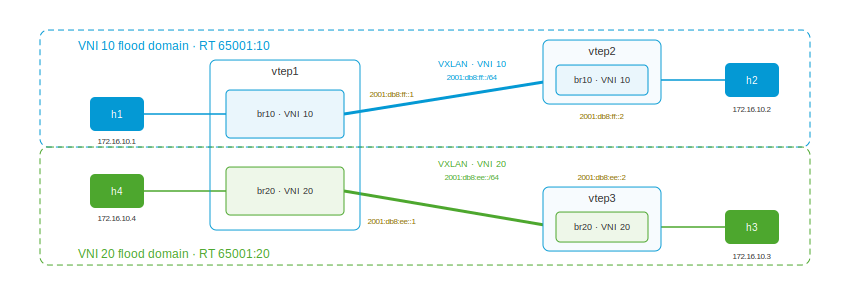

# BGP EVPN VXLAN multi-tenant (IPv6 transport)

This playset combines the two extensions of the base EVPN lab: the
multi-tenant topology of
[bgp-evpn-vxlan4-multi](../bgp-evpn-vxlan4-multi/README.md) running over
the **IPv6** VXLAN underlay of
[bgp-evpn-vxlan6](../bgp-evpn-vxlan6/README.md). Three VTEPs carry two
tenants — VNI 10 (h1 behind vtep1, h2 behind vtep2) and VNI 20 (h3 behind
vtep3, h4 behind vtep1) — and every tunnel endpoint, next hop, PMSI
endpoint, and FDB `dst` is IPv6. vtep1 is the multi-tenant VTEP, serving
both VNIs, each over its own IPv6 underlay link.

All four hosts share the same IPv4 subnet (`172.16.10.0/24`): tenants can
even overlap addresses and still never see each other. Isolation comes
from the VNI and its route-target, not from the underlay's address family
— which here happens to be IPv6 end to end.



## Bring up all nodes

``` shell
$ ./up.sh
bring up
...
apply config: h3
applied
apply config: h4
applied
```

## The multi-tenant VTEP over two IPv6 links

`vtep1.yaml` carries both tenants. Each tenant is a `bridge` + `vxlan`
pair with its own IPv6 `local-address` on a different underlay link, and a
BGP session toward the matching remote VTEP over IPv6. The BGP `router-id`
stays a 32-bit dotted-quad (`10.0.0.1`):

``` yaml
interface:
- if-name: vtep1-vtep2
  ipv6:
    address: 2001:db8:ff::1/64
- if-name: vtep1-vtep3
  ipv6:
    address: 2001:db8:ee::1/64
- if-name: vtep1-h1
  bridge: br10
- if-name: vtep1-h4
  bridge: br20
system:
  hostname: vtep1
bridge:
- name: br10
- name: br20
vxlan:
- name: vxlan10
  vni: 10
  local-address: 2001:db8:ff::1
  bridge: br10
- name: vxlan20
  vni: 20
  local-address: 2001:db8:ee::1
  bridge: br20
router:
  bgp:
    global:
      as: 65001
      router-id: 10.0.0.1
    afi-safi:
    - name: evpn
      advertise-all-vni: true
    neighbor:
    - remote-address: 2001:db8:ff::2
      enabled: true
      remote-as: 65001
      afi-safi:
      - name: evpn
        enabled: true
    - remote-address: 2001:db8:ee::2
      enabled: true
      remote-as: 65001
      afi-safi:
      - name: evpn
        enabled: true
```

`vxlan10` rides the `2001:db8:ff::/64` link toward vtep2; `vxlan20` rides
`2001:db8:ee::/64` toward vtep3. Two `external`/`vnifilter` devices coexist
on the same UDP port 4789 — `vnifilter` demultiplexes each received VNI to
the device that registered it. `vtep2.yaml` (VNI 10 only) and `vtep3.yaml`
(VNI 20 only) are single-tenant VTEPs. The hosts are one IPv4 address each,
unaware of the IPv6 core beneath them:

``` yaml
interface:
- if-name: h3-vtep3
  ipv4:
    address: 172.16.10.3/24
system:
  hostname: h3
```

## One BGP table, two tenants, IPv6 next hops

`vtep1` holds both IPv6 sessions and both tenants' routes. The
route-target keeps them apart; the next hop and PMSI endpoint are the IPv6
VTEP addresses, each on the tenant's own underlay link:

``` shell
$ sudo ip netns exec vtep1 vty
vtep1>show bgp summary
...
L2VPN EVPN Summary:
BGP router identifier 10.0.0.1, local AS number 65001 VRF default vrf-id 0
RIB entries 8
Peers 2

Neighbor        V         AS   MsgRcvd   MsgSent   TblVer  InQ OutQ  Up/Down State       PfxRcd/Snt Hostname
2001:db8:ee::2  4      65001         6         3        0    0    0 00:00:21 Established        2/4 s
2001:db8:ff::2  4      65001         6         3        0    0    0 00:00:21 Established        2/4 s
vtep1>show bgp evpn
...
   Network          Next Hop            Metric LocPrf Weight Path
Route Distinguisher: 10.0.0.1:10
 *>  [2]:[0]:[48]:[32:e3:6d:79:82:4c]
                    2001:db8:ff::1             0         32768 i
                    Extended community: RT:65001:10 ET:8
 *>  [2]:[0]:[48]:[ae:aa:79:f4:1b:65]
                    2001:db8:ff::1             0         32768 i
                    Extended community: RT:65001:10 ET:8
 *>  [3]:[0]:[128]:[2001:db8:ff::1]
                    2001:db8:ff::1             0         32768 i
                    Extended community: RT:65001:10 ET:8
                    PMSI: ingress-replication endpoint:2001:db8:ff::1 vni:10
Route Distinguisher: 10.0.0.1:20
 *>  [2]:[0]:[48]:[5a:48:34:4c:5f:7c]
                    2001:db8:ee::1             0         32768 i
                    Extended community: RT:65001:20 ET:8
 *>  [2]:[0]:[48]:[a6:fc:97:16:d4:82]
                    2001:db8:ee::1             0         32768 i
                    Extended community: RT:65001:20 ET:8
 *>  [3]:[0]:[128]:[2001:db8:ee::1]
                    2001:db8:ee::1             0         32768 i
                    Extended community: RT:65001:20 ET:8
                    PMSI: ingress-replication endpoint:2001:db8:ee::1 vni:20
Route Distinguisher: 10.0.0.2:10
 *>  [2]:[0]:[48]:[16:69:7d:ee:98:2e]
                    2001:db8:ff::2             0    100      0 i
                    Extended community: RT:65001:10 ET:8
 ...
Route Distinguisher: 10.0.0.3:20
 *>  [2]:[0]:[48]:[32:6c:14:70:f6:59]
                    2001:db8:ee::2             0    100      0 i
                    Extended community: RT:65001:20 ET:8
 *>  [3]:[0]:[128]:[2001:db8:ee::2]
                    2001:db8:ee::2             0    100      0 i
                    Extended community: RT:65001:20 ET:8
                    PMSI: ingress-replication endpoint:2001:db8:ee::2 vni:20
```

Three things to notice:

* Four route distinguishers: vtep1 originates under both `10.0.0.1:10` and
  `10.0.0.1:20`; vtep2 contributes only `:10`, vtep3 only `:20`. The RD is
  IPv4 (from the 32-bit `router-id`) even though the transport is IPv6 — an
  RD's IP field is four bytes and cannot hold an IPv6 address.
* Per-VNI IPv6 endpoints on the right link: vtep1's VNI 10 routes next-hop
  `2001:db8:ff::1` (toward vtep2), its VNI 20 routes `2001:db8:ee::1`
  (toward vtep3). Each tenant's tunnel rides its own IPv6 underlay.
* The Type-3 IMET NLRI is `[3]:[0]:[128]:[...]` — a 128-bit originating IP
  — and `RT:65001:10` vs `RT:65001:20` is the tenant boundary.

## Kernel view: two tenants, two IPv6 flood domains

``` shell
vtep1>bridge vni
dev               vni                group/remote
vxlan10           10
vxlan20           20
vtep1>bridge fdb show dev vxlan10
16:69:7d:ee:98:2e dst 2001:db8:ff::2 vni 10 src_vni 10 self extern_learn permanent
00:00:00:00:00:00 dst 2001:db8:ff::2 vni 10 src_vni 10 self extern_learn permanent
b6:81:f5:c2:45:b8 dst 2001:db8:ff::2 vni 10 src_vni 10 self extern_learn permanent
vtep1>bridge fdb show dev vxlan20
00:00:00:00:00:00 dst 2001:db8:ee::2 vni 20 src_vni 20 self extern_learn permanent
5a:7b:1c:32:67:e1 dst 2001:db8:ee::2 vni 20 src_vni 20 self extern_learn permanent
32:6c:14:70:f6:59 dst 2001:db8:ee::2 vni 20 src_vni 20 self extern_learn permanent
```

`vxlan10`'s remote entries — including the all-zeros BUM flood entry from
vtep2's Type-3 IMET — all point at `2001:db8:ff::2`; `vxlan20`'s all point
at `2001:db8:ee::2`. Two tenants, two IPv6 tunnel endpoints, nothing
shared.

## Intra-tenant: both segments forward

``` shell
$ sudo ip netns exec h1 ping 172.16.10.2      # VNI 10: h1 -> h2
64 bytes from 172.16.10.2: icmp_seq=1 ttl=64 time=0.055 ms
64 bytes from 172.16.10.2: icmp_seq=2 ttl=64 time=0.085 ms

$ sudo ip netns exec h3 ping 172.16.10.4      # VNI 20: h3 -> h4
64 bytes from 172.16.10.4: icmp_seq=1 ttl=64 time=0.078 ms
64 bytes from 172.16.10.4: icmp_seq=2 ttl=64 time=0.143 ms
```

`ttl=64` on both — each tenant is one flat L2 segment. On the wire, the
h3↔h4 traffic rides the vtep1–vtep3 link inside VNI 20 over IPv6:

``` shell
vtep1>tcpdump -nli vtep1-vtep3 udp port 4789
11:46:35.168795 IP6 2001:db8:ee::2.39171 > 2001:db8:ee::1.4789: VXLAN, flags [I] (0x08), vni 20
IP 172.16.10.3 > 172.16.10.4: ICMP echo request, id 15965, seq 2, length 64
11:46:35.168870 IP6 2001:db8:ee::1.39171 > 2001:db8:ee::2.4789: VXLAN, flags [I] (0x08), vni 20
IP 172.16.10.4 > 172.16.10.3: ICMP echo reply, id 15965, seq 2, length 64
```

An IPv4 tenant frame nested inside a VNI 20 VXLAN header over IPv6.

## Cross-tenant: nothing forwards

Every pairing between the tenants fails — h1/h2 (VNI 10) reach neither h3
nor h4 (VNI 20), even though all four believe they share
`172.16.10.0/24`:

``` shell
$ sudo ip netns exec h1 ping -c 2 -W 1 172.16.10.3
--- 172.16.10.3 ping statistics ---
2 packets transmitted, 0 received, 100% packet loss

$ sudo ip netns exec h1 ip neigh show dev h1-vtep1
172.16.10.3 INCOMPLETE
172.16.10.4 INCOMPLETE
172.16.10.2 lladdr 16:69:7d:ee:98:2e DELAY
```

(same for h2→h3, h2→h4)

The ping dies at ARP: h1 resolves its VNI 10 peer (h2) but never gets an
answer from the VNI 20 hosts. h1's broadcast enters `br10` and floods only
along VNI 10's ingress-replication list, which contains only VNI 10 VTEPs.
h4 sits one namespace away on the same vtep1, but on `br20`; with no
interface, VLAN, or route shared between the bridges and distinct
route-targets in BGP, there is no path — the same tenant isolation as the
IPv4 lab, here over an IPv6-only core.

## Tear down

``` shell
$ ./down.sh
```

## Appendix: Addresses

| node  | role            | underlay (IPv6)                    | overlay (IPv4, tenant)  | router-id |
|:------|:----------------|:-----------------------------------|:------------------------|:----------|
| vtep1 | VTEP, both VNIs | 2001:db8:ff::1/64, 2001:db8:ee::1/64 | —                     | 10.0.0.1  |
| vtep2 | VTEP, VNI 10    | 2001:db8:ff::2/64                  | —                       | 10.0.0.2  |
| vtep3 | VTEP, VNI 20    | 2001:db8:ee::2/64                  | —                       | 10.0.0.3  |
| h1    | host            | —                                  | 172.16.10.1/24 (VNI 10) | —         |
| h2    | host            | —                                  | 172.16.10.2/24 (VNI 10) | —         |
| h3    | host            | —                                  | 172.16.10.3/24 (VNI 20) | —         |
| h4    | host            | —                                  | 172.16.10.4/24 (VNI 20) | —         |

VXLAN UDP 4789 over IPv6, iBGP AS 65001. Per-VNI RD `<router-id>:<vni>`
(IPv4, from the BGP identifier); RT `65001:<vni>` (auto-derived from the
VNI) — `RT:65001:10` vs `RT:65001:20` is the control-plane tenant
boundary. Tunnel endpoints and next hops IPv6.
