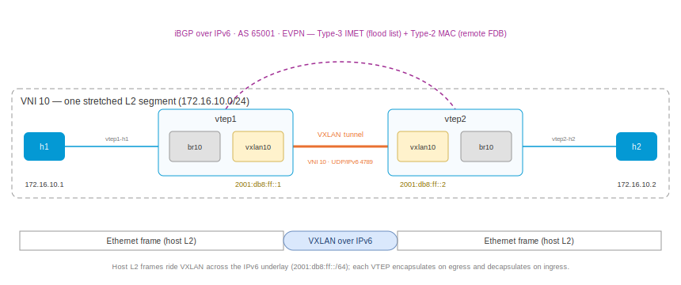

# BGP EVPN VXLAN (IPv6 transport)

This playset is the IPv6-underlay sibling of
[bgp-evpn-vxlan4](../bgp-evpn-vxlan4/README.md): the same stretched L2
segment and the same EVPN control plane, but the VXLAN tunnel now rides
**UDP over IPv6** instead of IPv4. Two VTEPs connect two hosts on one IP
subnet; the only thing that changes versus the IPv4 lab is the transport
underneath — VTEP addresses, the BGP session, the advertised next hops,
the PMSI endpoints, and the kernel FDB `dst` are all IPv6.

The tenant payload stays IPv4 (`172.16.10.0/24`) to make the point sharp:
an ordinary IPv4 host segment is carried, unchanged, across an IPv6-only
core. VXLAN's outer/inner independence means the overlay never sees the
underlay's address family.



## Bring up all nodes

``` shell
$ ./up.sh
bring up
...
apply config: h2
applied
```

## What makes this the IPv6 version

`vtep1.yaml` — note the `ipv6` underlay address, the IPv6 `local-address`
on the VXLAN device, and the IPv6 BGP neighbor. The BGP `router-id` stays
a 32-bit dotted-quad (BGP identifiers are always four bytes, regardless of
transport):

``` yaml
interface:
- if-name: vtep1-vtep2
  ipv6:
    address: 2001:db8:ff::1/64
- if-name: vtep1-h1
  bridge: br10
system:
  hostname: vtep1
bridge:
- name: br10
vxlan:
- name: vxlan10
  vni: 10
  local-address: 2001:db8:ff::1
  bridge: br10
router:
  bgp:
    global:
      as: 65001
      router-id: 10.0.0.1
    afi-safi:
    - name: evpn
      advertise-all-vni: true
    neighbor:
    - remote-address: 2001:db8:ff::2
      enabled: true
      remote-as: 65001
      afi-safi:
      - name: evpn
        enabled: true
```

The `local-address: 2001:db8:ff::1` is what turns the VTEP into an
IPv6 tunnel endpoint: the daemon creates the single-VXLAN-device (external
/ vnifilter) with an IPv6 outer source, so every frame it encapsulates
leaves as VXLAN-in-IPv6. Everything else — the bridge, the tunnel VLAN
mapping, `advertise-all-vni` — is identical to the IPv4 lab.

The hosts (`h1.yaml` / `h2.yaml`) are unchanged from the IPv4 playset —
plain IPv4 addresses, no knowledge of the underlay:

``` yaml
interface:
- if-name: h1-vtep1
  ipv4:
    address: 172.16.10.1/24
system:
  hostname: h1
```

## The EVPN session runs over IPv6

``` shell
$ sudo ip netns exec vtep1 vty
vtep1>show bgp summary
...
L2VPN EVPN Summary:
BGP router identifier 10.0.0.1, local AS number 65001 VRF default vrf-id 0
RIB entries 4
Peers 1

Neighbor        V         AS   MsgRcvd   MsgSent   TblVer  InQ OutQ  Up/Down State       PfxRcd/Snt Hostname
2001:db8:ff::2  4      65001         6         3        0    0    0 00:00:18 Established        2/2 s
```

The peer is an IPv6 address; the iBGP session that carries the EVPN NLRI is
a TCP session over IPv6.

## The EVPN RIB: IPv6 next hops, IPv4 route distinguishers

``` shell
vtep1>show bgp evpn
...
   Network          Next Hop            Metric LocPrf Weight Path
Route Distinguisher: 10.0.0.1:10
 *>  [2]:[0]:[48]:[6a:1e:74:33:8e:fe]
                    2001:db8:ff::1             0         32768 i
                    Extended community: RT:65001:10 ET:8
 *>  [2]:[0]:[48]:[be:15:c1:b9:90:4e]
                    2001:db8:ff::1             0         32768 i
                    Extended community: RT:65001:10 ET:8
 *>  [3]:[0]:[128]:[2001:db8:ff::1]
                    2001:db8:ff::1             0         32768 i
                    Extended community: RT:65001:10 ET:8
                    PMSI: ingress-replication endpoint:2001:db8:ff::1 vni:10
Route Distinguisher: 10.0.0.2:10
 *>  [2]:[0]:[48]:[ea:29:50:a7:c4:22]
                    2001:db8:ff::2             0    100      0 i
                    Extended community: RT:65001:10 ET:8
 *>  [3]:[0]:[128]:[2001:db8:ff::2]
                    2001:db8:ff::2             0    100      0 i
                    Extended community: RT:65001:10 ET:8
                    PMSI: ingress-replication endpoint:2001:db8:ff::2 vni:10
```

Two address families, cleanly separated — exactly as the standards
require:

* **Next Hop** and the **PMSI ingress-replication endpoint** are the IPv6
  VTEP addresses (`2001:db8:ff::1` / `::2`) — the outer tunnel address a
  remote VTEP encapsulates toward.
* The **Type-3 IMET** NLRI is `[3]:[0]:[128]:[2001:db8:ff::1]` — the
  Originating Router's IP is a 128-bit (IPv6) address, versus `[32]` in
  the IPv4 lab.
* The **Route Distinguisher** is `10.0.0.1:10`, derived from the 32-bit
  BGP `router-id`, not the tunnel address (an RD's IP field is four bytes
  and could not hold an IPv6 address). The **route-target** `RT:65001:10`
  is still auto-derived from the VNI.

## How the routes land in the kernel

``` shell
vtep1>bridge fdb show dev vxlan10
ee:04:55:b3:27:be vlan 1 extern_learn master br10
ea:29:50:a7:c4:22 vlan 1 extern_learn master br10
96:e2:83:8d:74:fa vlan 1 master br10 permanent
ee:04:55:b3:27:be dst 2001:db8:ff::2 vni 10 src_vni 10 self extern_learn permanent
00:00:00:00:00:00 dst 2001:db8:ff::2 vni 10 src_vni 10 self extern_learn permanent
ea:29:50:a7:c4:22 dst 2001:db8:ff::2 vni 10 src_vni 10 self extern_learn permanent
vtep1>bridge vni
dev               vni                group/remote
vxlan10           10
vtep1>bridge vlan tunnelshow
port              vlan-id    tunnel-id
vxlan10           1          10
```

The remote FDB entries — including the all-zeros BUM flood entry from the
peer's Type-3 IMET — carry an IPv6 `dst` (`2001:db8:ff::2`). The
VLAN 1 → VNI 10 tunnel mapping is exactly the same as the IPv4 lab; only
the tunnel endpoint address family differs.

You can confirm the device's IPv6 outer source directly:

``` shell
vtep1>ip -d link show vxlan10
... vxlan external vnifilter id 0 ... local 2001:db8:ff::1 ...
```

## `ping` across the stretched segment

``` shell
$ sudo ip netns exec h1 vty
h1>ping 172.16.10.2
PING 172.16.10.2 (172.16.10.2) 56(84) bytes of data.
64 bytes from 172.16.10.2: icmp_seq=1 ttl=64 time=0.056 ms
64 bytes from 172.16.10.2: icmp_seq=2 ttl=64 time=0.079 ms
```

`ttl=64` — one L2 segment, no router hop. On the underlay link the frames
ride VXLAN over IPv6 with the IPv4 host packets inside:

``` shell
vtep1>tcpdump -nli vtep1-vtep2 udp port 4789
tcpdump: verbose output suppressed, use -v[v]... for full protocol decode
listening on vtep1-vtep2, link-type EN10MB (Ethernet), snapshot length 262144 bytes
11:36:56.392236 IP6 2001:db8:ff::1.39940 > 2001:db8:ff::2.4789: VXLAN, flags [I] (0x08), vni 10
IP 172.16.10.1 > 172.16.10.2: ICMP echo request, id 11996, seq 2, length 64
11:36:56.392275 IP6 2001:db8:ff::2.39940 > 2001:db8:ff::1.4789: VXLAN, flags [I] (0x08), vni 10
IP 172.16.10.2 > 172.16.10.1: ICMP echo reply, id 11996, seq 2, length 64
```

`IP6 2001:db8:ff::1 > 2001:db8:ff::2.4789` is the outer IPv6 VXLAN
header; `IP 172.16.10.1 > 172.16.10.2` is the tenant's IPv4 ICMP nested
inside — an IPv4 segment stretched intact across an IPv6-only core.

## Tear down

``` shell
$ ./down.sh
```

## Appendix: Addresses

| node  | role | underlay (IPv6)   | overlay (IPv4) | BGP router-id |
|:------|:-----|:------------------|:---------------|:--------------|
| vtep1 | VTEP | 2001:db8:ff::1/64 | —              | 10.0.0.1      |
| vtep2 | VTEP | 2001:db8:ff::2/64 | —              | 10.0.0.2      |
| h1    | host | —                 | 172.16.10.1/24 | —             |
| h2    | host | —                 | 172.16.10.2/24 | —             |

VNI 10, UDP port 4789 over IPv6, iBGP AS 65001; RD `<router-id>:10`
(IPv4, from the BGP identifier), RT `65001:10` (auto-derived from the
VNI), tunnel endpoints and next hops IPv6.
