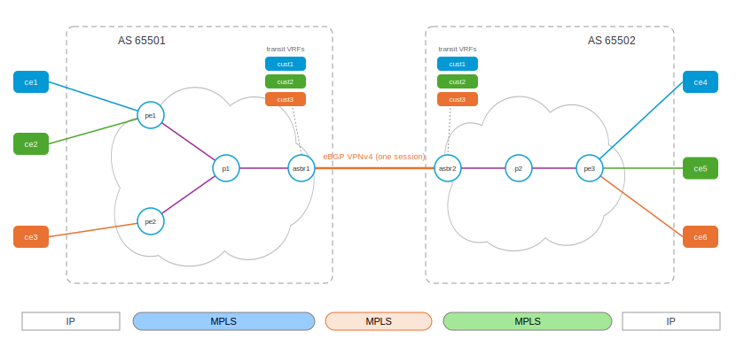

# Inter-AS L3VPN Option AB — per-VPN VRFs, one VPNv4 session

Options A and B renegotiated one trade: A gave every customer its own
border interface, session, and VRF (perfect isolation, painful scaling);
B collapsed the border to one MP-BGP session (one session forever, but
the per-customer policy point disappeared). Cisco's **Option AB** — a
vendor hybrid beyond RFC 4364 §10's three letters — recombines them:

> The MPLS VPN Inter-AS Option AB feature combines the best functionality
> of an Inter-AS Option (10) A and Inter-AS Option (10) B network […]
> the different autonomous systems interconnect by using a single MP-BGP
> session in the global routing table to carry control plane traffic,
> [while the network] maintains IP quality of service functions between
> ASBR peers.

The ASBR keeps a **VRF per customer, like A** — but with no interface,
no CE, and no per-VRF session: a pure *transit* VRF that exists to be the
per-VPN forwarding and policy point. Route exchange runs over a **single
eBGP VPNv4 session, like B**. Each hybrid VRF re-originates what it
imports — under the ASBR's own RD, with itself as next hop, a fresh
per-VRF label, and its own export RT replacing whatever arrived — which
is, line for line, Cisco's Option AB route-distribution procedure:

> ASBR1 imports the prefix into VPN 1 and creates a prefix RD 5:N […]
> sets itself as the next hop […] and allocates a local label that is
> signaled with this prefix. ASBR2 receives the prefix RD 5:N and imports
> it into VPN 1 as RD 7:N [and] advertises the route with the export RT
> configured on the VRF rather than the originally received RTs.



```
  ce1 ─┐                                                  ┌─ ce3   (cust1)
       pe1 ── p1 ── asbr1 ═══ one eBGP VPNv4 session ═══ asbr2 ── p2 ── pe2
  ce2 ─┘        AS 65501     [cust1][cust2] transit VRFs   AS 65502      └─ ce4   (cust2)
                              at BOTH borders — the VPN
                              label terminates, an IP
                              lookup happens per customer,
                              and a fresh label goes on
```

The lab is the same pared ten-router variant as the Option C playset
(two customers, overlapping addressing) — only the ASBRs change. One honest
note: classic Cisco AB forwards the customer *data* unlabeled over
per-VRF subinterfaces (that is where the per-customer QoS attaches),
with only the control session shared. This lab implements the
labeled-data-path flavor (Cisco documents it as Option AB+): data rides
the same shared link as the session, one label deep — but each ASBR
still terminates the VPN into the customer's own VRF, makes an IP
routing decision there, and re-imposes; the per-VPN state and policy
point that Option B lost is restored at both borders.

## Bring up all nodes

``` shell
$ ./up.sh
bring up
...
apply config: ce3
applied
apply config: ce4
applied
```

## The ASBR: two VRFs, no VRF anything else

`asbr1.yaml`'s BGP shape — compare all three siblings at the same spot:
Option A had per-VRF *sessions*, B had *no VRFs at all*, AB has VRFs
with nothing in them but policy:

``` yaml
vrf:
- name: cust1
  ipv4:
    route-target:
      import:
      - 65501:100
      export:
      - 65501:100
- name: cust2
  ipv4:
    route-target:
      import:
      - 65501:200
      export:
      - 65501:200
router:
  bgp:
    global:
      as: 65501
      router-id: 1.1.1.3
    neighbor:
    - remote-address: 1.1.1.1        # PE1 — iBGP VPNv4 (no next-hop-self!)
      remote-as: 65501
      update-source: 1.1.1.3
      afi-safi:
      - name: vpnv4
        enabled: true
    - remote-address: 192.168.100.2  # ASBR2 — ONE eBGP VPNv4, all customers
      remote-as: 65502
      afi-safi:
      - name: vpnv4
        enabled: true
    vrf:
    - name: cust1
      rd: 65501:11
      inter-as-hybrid: true          # <- THE Option AB knob
    - name: cust2
      rd: 65501:12
      inter-as-hybrid: true
```

* **`inter-as-hybrid: true`** turns each VRF into the AB relay: the
  VPNv4 routes its RT imports are re-exported — re-originated under the
  VRF's own RD (`65501:11`/`12`, deliberately distinct from the PEs'
  `65501:1`/`2`), next-hop-self, the VRF's per-VRF label, single clean
  RT. The transparent Option-B-style relay of the received route is
  suppressed; each router sees every prefix under exactly one RD.
* **No `next-hop-self` knob anywhere** — Option B needed it on the iBGP
  leg; here the re-export is a local origination, so both legs get
  self as next hop for free.
* The top-level `vrf:` block alone creates the kernel VRF devices, which
  is what the data path hangs off (below).

## Control plane: the RD chain

``` shell
asbr1>show bgp vrf
VRF                  RD                Label  TableID  Peers State
cust1                65501:11             16        1      0 running
cust2                65501:12             17        2      0 running
```

Two customers, two labels, **zero peers** — the VRFs are pure policy
anchors (Option A showed `1` in that Peers column per VRF, and its label
terminated into a session; B showed `(no VRFs configured)`).

``` shell
asbr1>show bgp vpnv4
     Network          Next Hop            Metric LocPrf Weight Path
Route Distinguisher: 65501:1
 *>i [1] 10.11.0.0/30       1.1.1.1                  0    100      0 65511 i
     rt:65501:100 label=16,
 *>i [1] 172.16.1.1/32      1.1.1.1                  0    100      0 65511 i
     rt:65501:100 label=16,
Route Distinguisher: 65501:11
 *>  [1] 10.11.0.0/30       1.1.1.3                  0    100      0 65511 i
     rt:65501:100 label=16,
 *>  [1] 172.16.1.1/32      1.1.1.3                  0    100      0 65511 i
     rt:65501:100 label=16,
 *>  [1] 10.13.0.0/30       1.1.1.3                  0             0 65502 65513 i
     rt:65501:100 label=16,
 *>  [1] 172.16.2.1/32      1.1.1.3                  0             0 65502 65513 i
     rt:65501:100 label=16,
Route Distinguisher: 65502:11
 *>  [1] 10.13.0.0/30       192.168.100.2            0             0 65502 65513 i
     rt:65501:100 label=16,
 *>  [1] 172.16.2.1/32      192.168.100.2            0             0 65502 65513 i
     rt:65501:100 label=16,
...
```

(cust2 mirrors under `65501:2` / `65501:12` / `65502:12`.) Read it as
Cisco's procedure executing: PE1's originals under `65501:1`; the hybrid
VRF's re-originations under **`65501:11`** — next-hop rewritten to
`1.1.1.3` (self), the VRF's own label `16`, one clean `rt:65501:100`
whether the source was PE1 (iBGP) or ASBR2 (the `65502:11` rows below,
kept for import but never transparently relayed). The far ASBR's own
re-originations arrive under *its* RD — a prefix's RD changes at every
border, unlike B where RDs crossed untouched.

## Data plane: label in, IP lookup, label out — per customer

``` shell
asbr1>ip -f mpls route | grep "dev cust"
16 dev cust1 proto bgp
17 dev cust2 proto bgp

asbr1>show ip route vrf cust1
...
B  *> 10.11.0.0/30 [200/0] via 10.1.0.5, asbr1-p1, label 16011 16, 00:00:52
B  *> 10.13.0.0/30 [200/0] via 192.168.100.2, asbr1-asbr2, label 16, 00:00:50
B  *> 172.16.1.1/32 [200/0] via 10.1.0.5, asbr1-p1, label 16011 16, 00:00:52
B  *> 172.16.2.1/32 [200/0] via 192.168.100.2, asbr1-asbr2, label 16, 00:00:50
```

`16 dev cust1` is the whole Option AB data plane in one line: MPLS label
16 arrives → **deliver into the cust1 VRF** for an IP routing decision.
The VRF's table then re-imposes: toward PE1 a two-label stack
(`16011 16`), toward ASBR2 a single label (`16`, ASBR2's cust1 label).
Contrast the same spot in Option B — a flat list of per-prefix
`X as to Y` label swaps with no IP lookup and no per-customer anything.

``` shell
$ sudo ip netns exec ce1 vty
ce1>ping 172.16.2.1
64 bytes from 172.16.2.1: icmp_seq=1 ttl=60 time=0.077 ms
```

`ttl=60` — four IP routing decisions: pe1, **asbr1 (in cust1)**,
**asbr2 (in cust1)**, pe2. Option B also showed 60, but its border
decrements came from MPLS TTL on label swaps; here they are genuine
per-customer IP lookups (Option C, which does neither, showed 62). On
the wire, one label crosses — same as B — but watch the TTL inside:

``` shell
asbr1>tcpdump -nli asbr1-p1 mpls        # arriving from the core
MPLS (label 16, tc 0, [S], ttl 63) IP 10.11.0.1 > 172.16.2.1: ICMP echo request ...
asbr1>tcpdump -nli asbr1-asbr2 mpls     # leaving across the border
MPLS (label 16, tc 0, [S], ttl 62) IP 10.11.0.1 > 172.16.2.1: ICMP echo request ...
```

The label value happens to be 16 on both sides (each router's first
per-VRF label), but they are different labels from different spaces —
and the decremented TTL between them is the IP lookup in `cust1`
happening. The overlap proof holds as in every lab in this series:
ce1's and ce2's pings to the same `172.16.2.1` land on ce3 and ce4
respectively, zero leakage — here because each customer's traffic
threads its own VRF at both borders.

## A best-path fix this lab flushed out

Option AB's hybrid re-export has an echo: ASBR2 re-originates everything
its VRFs import — *including PE2's own prefixes* — and PE2 imports the
echo back (the RTs match; iBGP carries no AS-path loop protection for
it). Building this playset exposed a zebra-rs best-path bug: VRF rows
imported from the VPN table carried the locally-originated route type
(the tunnel FIB-install path keys on it), so at PE2 the echo **beat the
CE's direct eBGP route** at the locally-originated tiebreak, and
customer traffic looped back into the core.

The fix (in this playset's PR) marks imported rows `vrf_imported` and
teaches best-path two things: an import is not a local origination, and
it ranks as iBGP — so RFC 4271's prefer-external step picks the direct
CE route. The result is visible on PE2:

``` shell
pe2>show bgp vrf cust1
    Network            Next Hop            Metric LocPrf Weight Path
 *>  172.16.2.1/32      10.13.0.1                0             0 65513 i
 *   172.16.2.1/32      2.2.2.3                  0    100      0 65513 i

pe2>show ip route vrf cust1
B  *> 172.16.2.1/32 [20/0] via 10.13.0.1, pe2-ce3, 00:00:50
```

The direct CE route wins (`*>`); the echo stays in the table, valid but
not best (`*`) — present, harmless, and a nice fingerprint of how AB's
re-origination machinery works.

## The quadrant, completed

| | per-customer state at the border | sessions crossing the border |
|:--|:--|:--|
| **Option A** | VRFs + interfaces + sessions | one per customer |
| **Option B** | none | one |
| **Option AB** | VRFs (policy/forwarding only) | **one** |
| **Option C** | none — not even VPN routes | one (+ PE/RR multihop VPNv4) |

Option AB is what you pick when you want B's single-session border but
cannot give up the per-customer enforcement point: per-VPN QoS,
policing, per-customer route limits and RT policy all get a VRF to
attach to at the boundary, without a single per-customer session or
subinterface. The cost is Option A's state (a VRF and label per customer
per ASBR — the border scales with customers again) plus B's coordination
(RTs must still be agreed across the ASes).

## Tear down

``` shell
$ ./down.sh
```

## Appendix: Addressing & sessions

Identical to the [Option C playset](../interas-option-c/README.md#appendix-addressing--sessions)
except the ASBRs' VRFs: nodes, AS numbers, loopbacks, SR SIDs, links,
customer addressing, and the single global inter-AS link
(`192.168.100.0/30`) are unchanged.

| VPN   | RT (coordinated) | RD on pe1 | RD on asbr1 | RD on asbr2 | RD on pe2 |
|:------|:-----------------|:----------|:------------|:------------|:----------|
| cust1 | 65501:100        | 65501:1   | 65501:11    | 65502:11    | 65502:1   |
| cust2 | 65501:200        | 65501:2   | 65501:12    | 65502:12    | 65502:2   |

BGP sessions: 4× PE-CE eBGP IPv4 (in VRF), 2× iBGP VPNv4 over loopbacks
(no next-hop-self needed), and **one** ASBR-ASBR eBGP VPNv4 session —
with the per-customer VRFs riding on `inter-as-hybrid` at both borders.

## Sources

* Cisco, *MPLS VPN—Inter-AS Option AB* (the feature guide; Cisco has
  removed the live pages, archived copy):
  <https://web.archive.org/web/2024/https://www.cisco.com/c/en/us/td/docs/ios-xml/ios/mp_ias_and_csc/configuration/xe-16/mp-ias-and-csc-xe-16-book/mpls-vpn-inter-as-option-ab.html>
* Cisco, *Configuring MPLS VPN Inter-AS Options*:
  <https://www.cisco.com/c/en/us/td/docs/switches/lan/catalyst9400/software/release/17-16/configuration_guide/mpls/b_1716_mpls_9400_cg/configuring_mpls_vpn_interas_options.html>
* RFC 4364, *BGP/MPLS IP Virtual Private Networks*, §10 — Options A/B/C
  (AB is a Cisco-documented hybrid of (a) and (b)).
* QuistED, *Inter-AS MPLS L3VPN Options (A, B, C)* (for the base options
  AB recombines):
  <https://www.quisted.net/index.php/2025/09/12/inter-as-mpls-l3vpn-options-a-b-c/>
