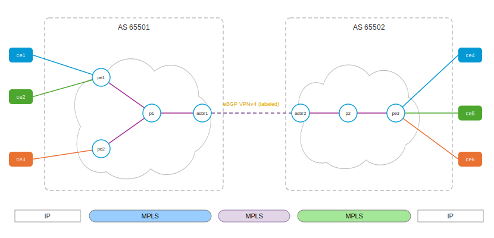

# Inter-AS L3VPN Option B — eBGP VPNv4 between the ASBRs

This playset builds the second of RFC 4364 §10's multi-AS methods —
**Option B (§10b)**, *EBGP redistribution of labeled VPN-IPv4 routes from
AS to neighboring AS*. It is the direct sequel to
[interas-option-a](../interas-option-a/README.md): the same reference
topology — three customers with deliberately overlapping addressing,
two PEs in AS 65501, one PE serving all three in AS 65502 — and only the
AS boundary changes. Where Option A needed one dedicated link and one
plain-IP eBGP session **per customer**, Option B collapses the border to
**one link and one MP-eBGP VPNv4 session carrying every customer**, and
the traffic that crosses it is **MPLS-labeled**.

In Cisco's terms: the ASBRs use eBGP to advertise labeled VPNv4 routes to
each other (the RFC 8277 label-carrying NLRI). The ASBRs hold every VPN
route — but, unlike Option A, **no VRF at all**: routes stay in the global
VPNv4 table, and for each route an ASBR re-advertises it allocates a fresh
local label and installs a label-swap entry. A VPN packet crosses the
provider boundary as a single label switch.



Deliberate choices, mirrored from the Option A lab so the two walkthroughs
diff cleanly:

* **Three customers** (`cust1`: ce1↔ce4, `cust2`: ce2↔ce5, `cust3`:
  ce3↔ce6) — this time all sharing the *single* inter-AS session and
  link, where Option A's border grew a link per customer.
* **Overlapping customer addressing** — all three use the same plan
  (site A loopback `172.16.1.1/32`, site B `172.16.2.1/32`). In Option A,
  separate per-VRF links kept the overlap apart at the boundary; here the
  overlapping routes cross **the same session**, kept apart only by their
  route distinguishers.
* **Coordinated route-targets, independent RDs** — the exact inverse of
  Option A's independence. VPNv4 attributes now cross the boundary intact,
  so both providers must agree on the RTs (`65501:100`/`200`/`300`, owned
  by AS 65501 and honored by AS 65502). The RDs stay AS-local (`65501:x`
  vs `65502:x`) — only the RT drives VRF import.

## Bring up all nodes

``` shell
$ ./up.sh
bring up
...
apply config: ce5
applied
apply config: ce6
applied
```

Same thirteen namespaces as Option A (`ce1 ce2 ce3 pe1 pe2 p1 asbr1` +
`asbr2 p2 pe3 ce4 ce5 ce6`) — bring up only one of the Inter-AS labs at a
time; they share namespace names.

## What changed since Option A: only the border

The CEs are the same plain eBGP speakers — a customer cannot tell which
option carries it. The P routers are identical. The PEs differ in exactly
one thing: `pe3`'s VRFs now import/export **AS 65501's** route-targets:

``` yaml
# pe3.yaml — RTs coordinated across the ASes (RDs still 65502:x)
vrf:
- name: cust1
  ipv4:
    route-target:
      import:
      - 65501:100
      export:
      - 65501:100
```

The ASBR is where the model lives. `asbr1.yaml`, in full:

``` yaml
interface:
- if-name: lo
  ipv4:
    address: 1.1.1.3/32
- if-name: asbr1-p1
  ipv4:
    address: 10.1.0.6/30
- if-name: asbr1-asbr2          # ONE inter-AS link, GLOBAL table
  ipv4:
    address: 192.168.100.1/30
system:
  hostname: asbr1
router:
  isis:
    net: 49.0001.0000.0000.0003.00
    is-type: level-2-only
    segment-routing: mpls
    te-router-id: 1.1.1.3
    interface:
    - if-name: lo
      ipv4:
        enabled: true
        prefix-sid:
          index: 13
    - if-name: asbr1-p1          # the inter-AS link is NOT in the IGP
      network-type: point-to-point
      ipv4:
        enabled: true
  bgp:
    global:
      as: 65501
      router-id: 1.1.1.3
    neighbor:
    - remote-address: 1.1.1.1        # iBGP VPNv4 to PE1
      remote-as: 65501
      update-source: 1.1.1.3
      afi-safi:
      - name: vpnv4
        enabled: true
        next-hop-self: true          # <- the Option B knob
    - remote-address: 1.1.1.4        # iBGP VPNv4 to PE2, same knob
      remote-as: 65501
      update-source: 1.1.1.3
      afi-safi:
      - name: vpnv4
        enabled: true
        next-hop-self: true
    - remote-address: 192.168.100.2  # eBGP VPNv4 to ASBR2 — ALL customers
      remote-as: 65502
      afi-safi:
      - name: vpnv4
        enabled: true
```

Three things to read out of it:

* **No `vrf:` block.** The Option A ASBR carried a VRF, an interface, and
  a session per customer; this one carries none of it:

  ``` shell
  asbr1>show bgp vrf
  VRF                  RD                Label  TableID  Peers State
    (no VRFs configured)
  ```

* **`next-hop-self: true` on the iBGP VPNv4 legs** (one per PE). A route
  re-advertised from AS 65502 would otherwise reach the PEs with ASBR2's
  inter-AS link address as its next hop — an address AS 65501's IGP
  cannot resolve. With next-hop-self, the PEs see ASBR1's loopback
  (reachable via SR) and ASBR1's own label, making ASBR1 the label-swap
  point.
* **The inter-AS link is in the global table and not in the IGP** — yet it
  carries MPLS, because labeled VPNv4 packets, not IP, cross it.

For orientation, the same node in classic Cisco IOS terms:

```
router bgp 65501
 neighbor 1.1.1.1 remote-as 65501          ! iBGP to PE1
 neighbor 1.1.1.4 remote-as 65501          ! iBGP to PE2
 neighbor 192.168.100.2 remote-as 65502    ! eBGP to ASBR2
 address-family vpnv4
  neighbor 1.1.1.1 activate
  neighbor 1.1.1.1 send-community extended
  neighbor 1.1.1.1 next-hop-self
  neighbor 1.1.1.4 activate
  neighbor 1.1.1.4 send-community extended
  neighbor 1.1.1.4 next-hop-self
  neighbor 192.168.100.2 activate
  neighbor 192.168.100.2 send-community extended
! no "ip vrf" anywhere; IOS enables "mpls bgp forwarding" on the
! inter-AS interface when the VPNv4 session comes up over it
```

## Control plane: six RDs on one session

``` shell
asbr1>show bgp summary
...
VPNv4 Unicast Summary:
BGP router identifier 1.1.1.3, local AS number 65501 VRF default vrf-id 0
RIB entries 12
Peers 3

Neighbor        V         AS   MsgRcvd   MsgSent   TblVer  InQ OutQ  Up/Down State       PfxRcd/Snt Hostname
1.1.1.1         4      65501         6         2        0    0    0 00:00:51 Established        4/6 s
1.1.1.4         4      65501         5         2        0    0    0 00:00:51 Established        2/6 s
192.168.100.2   4      65502         7         3        0    0    0 00:00:51 Established        6/6 s
```

One iBGP session per PE inward, and **one eBGP session outward carrying
all six far prefixes** — where the Option A ASBR needed a session per
customer, and would need one more for every customer added. Its VPNv4
table:

``` shell
asbr1>show bgp vpnv4
     Network          Next Hop            Metric LocPrf Weight Path
Route Distinguisher: 65501:1
 *>i [1] 10.11.0.0/30       1.1.1.1                  0    100      0 65511 i
     rt:65501:100 label=16,
 *>i [1] 172.16.1.1/32      1.1.1.1                  0    100      0 65511 i
     rt:65501:100 label=16,
Route Distinguisher: 65501:2
 *>i [1] 10.12.0.0/30       1.1.1.1                  0    100      0 65512 i
     rt:65501:200 label=17,
 *>i [1] 172.16.1.1/32      1.1.1.1                  0    100      0 65512 i
     rt:65501:200 label=17,
Route Distinguisher: 65501:3
 *>i [1] 10.13.0.0/30       1.1.1.4                  0    100      0 65513 i
     rt:65501:300 label=16,
 *>i [1] 172.16.1.1/32      1.1.1.4                  0    100      0 65513 i
     rt:65501:300 label=16,
Route Distinguisher: 65502:1
 *>  [1] 10.14.0.0/30       192.168.100.2            0             0 65502 65514 i
     rt:65501:100 label=22,
 *>  [1] 172.16.2.1/32      192.168.100.2            0             0 65502 65514 i
     rt:65501:100 label=23,
Route Distinguisher: 65502:2
 *>  [1] 10.15.0.0/30       192.168.100.2            0             0 65502 65515 i
     rt:65501:200 label=25,
 *>  [1] 172.16.2.1/32      192.168.100.2            0             0 65502 65515 i
     rt:65501:200 label=24,
Route Distinguisher: 65502:3
 *>  [1] 10.16.0.0/30       192.168.100.2            0             0 65502 65516 i
     rt:65501:300 label=26,
 *>  [1] 172.16.2.1/32      192.168.100.2            0             0 65502 65516 i
     rt:65501:300 label=27,
```

Compare this against the same command in the Option A walkthrough:

* **The far AS's RDs cross unchanged.** `65502:1`/`2`/`3` appear
  verbatim — Option B relays VPNv4 routes; it does not re-originate them
  under the local RD the way an Option A ASBR (being a PE) does. All
  three customers' overlapping `172.16.2.1/32` arrived over *one*
  session, distinguished purely by RD.
* **The iBGP rows name their PE**: cust1/cust2 from `1.1.1.1`,
  cust3 from `1.1.1.4` — the border aggregates every PE's exports over
  one session per PE.
* **Per-prefix labels on the far routes** (`22`–`27`, one per
  (RD, prefix)); the local AS's routes carry the PEs' per-VRF labels.
  No VRF exists here to terminate a label, so labels must be swapped
  route-by-route.

The kernel MPLS table is the whole forwarding story in one screen — every
`proto bgp` line an incoming-label → outgoing-label swap, and the inward
swaps name the owning PE (`16011` = pe1, `16014` = pe2):

``` shell
asbr1>ip -f mpls route | grep bgp
16 as to 16014/16 via inet 10.1.0.5 dev asbr1-p1 proto bgp
17 as to 16014/16 via inet 10.1.0.5 dev asbr1-p1 proto bgp
18 as to 16011/17 via inet 10.1.0.5 dev asbr1-p1 proto bgp
19 as to 16011/17 via inet 10.1.0.5 dev asbr1-p1 proto bgp
20 as to 16011/16 via inet 10.1.0.5 dev asbr1-p1 proto bgp
21 as to 16011/16 via inet 10.1.0.5 dev asbr1-p1 proto bgp
22 as to 26 via inet 192.168.100.2 dev asbr1-asbr2 proto bgp
23 as to 27 via inet 192.168.100.2 dev asbr1-asbr2 proto bgp
24 as to 25 via inet 192.168.100.2 dev asbr1-asbr2 proto bgp
25 as to 24 via inet 192.168.100.2 dev asbr1-asbr2 proto bgp
26 as to 22 via inet 192.168.100.2 dev asbr1-asbr2 proto bgp
27 as to 23 via inet 192.168.100.2 dev asbr1-asbr2 proto bgp
```

Two swap families:

* `16`–`21` are ASBR1's local labels for **AS 65501's own routes** (the
  labels it advertised to ASBR2). Each swaps to a two-label stack —
  transport to the owning PE's loopback plus that PE's VRF label — and
  heads into the SR core.
* `22`–`27` are ASBR1's local labels for the **far AS's routes** (the
  labels it advertised to the PEs, thanks to next-hop-self). Each swaps
  to the label ASBR2 advertised and heads out the inter-AS link — a
  single-label switch across the provider boundary.

The PEs' views close the loop — the far routes' next hop has been
rewritten to ASBR1's loopback carrying ASBR1's local label, and each
VRF route resolves to a two-label stack over the SR core:

``` shell
pe1>show bgp vpnv4
Route Distinguisher: 65502:1
 *>i [1] 10.14.0.0/30       1.1.1.3                  0    100      0 65502 65514 i
     rt:65501:100 label=26,
 *>i [1] 172.16.2.1/32      1.1.1.3                  0    100      0 65502 65514 i
     rt:65501:100 label=27,

pe1>show ip route vrf cust1
...
B  *> 172.16.2.1/32 [200/0] via 10.1.0.2, pe1-p1, label 16013 27, 00:01:15

pe2>show ip route vrf cust3
...
B  *> 172.16.2.1/32 [200/0] via 10.1.0.10, pe2-p1, label 16013 23, 00:01:16
```

## Data plane: labeled all the way across

``` shell
$ sudo ip netns exec ce1 vty
ce1>ping 172.16.2.1
PING 172.16.2.1 (172.16.2.1) 56(84) bytes of data.
64 bytes from 172.16.2.1: icmp_seq=1 ttl=60 time=0.073 ms
64 bytes from 172.16.2.1: icmp_seq=2 ttl=60 time=0.265 ms
```

Capturing the same ping inside AS 65501 and on the inter-AS link:

``` shell
p1>tcpdump -nli p1-pe1 'mpls 16013'               # pe1 -> p1 segment
MPLS (label 16013, tc 0, ttl 63) (label 27, tc 0, [S], ttl 63) IP 10.11.0.1 > 172.16.2.1: ICMP echo request ...

asbr1>tcpdump -nli asbr1-asbr2 mpls               # between the ASes
MPLS (label 23, tc 0, [S], ttl 62) IP 10.11.0.1 > 172.16.2.1: ICMP echo request ...
MPLS (label 21, tc 0, [S], ttl 62) IP 172.16.2.1 > 10.11.0.1: ICMP echo reply ...
```

Follow the request's labels against the tables above: PE1 imposed
`[16013 | 27]` (transport to ASBR1 + ASBR1's transit label for
172.16.2.1 in cust1); P1 popped the PHP'd transport; ASBR1 executed
`27 as to 23` — and the packet crossed the provider boundary carrying
**exactly one MPLS label**, ASBR2's `23`. No transport label is needed
on the border hop (the ASBRs are directly connected), and the VPN label
never disappears the way it did in Option A — where this same capture
point showed plain IP. The reply rides the mirror chain (ASBR2 swaps
toward ASBR1's `21`, cust1's route back to pe1).

The overlap proof from Option A holds unchanged — each customer's ping
to the same `172.16.2.1` lands only on its own site-B router:

|                  | arrives at ce4 | arrives at ce5 | arrives at ce6 |
|:-----------------|:---------------|:---------------|:---------------|
| ce1 (cust1) pings | **yes**       | —              | —              |
| ce2 (cust2) pings | —             | **yes**        | —              |
| ce3 (cust3) pings | —             | —              | **yes**        |

— but note what carries them now: the same wire, the same session, three
different label chains selected by RD.

## The trade, in both directions

Against **Option A**, this playset renegotiates exactly the pain points
the last one demonstrated:

* One link and one BGP session serve every customer — adding customer N
  touches the PEs only. The border scales with routes, not with VPNs.
* No per-customer VRFs, interfaces, or IP addressing at the border.

What it costs:

* **The ASBRs still hold every VPN route** — now in the global VPNv4
  table, plus a per-route transit label and swap ILM. The state moved out
  of VRFs; it did not shrink.
* **MPLS crosses the trust boundary.** Each provider forwards on labels
  the other allocated, and must police what arrives on the labeled link —
  Option A's "everything terminates at the border" security story is
  gone.
* **Attribute coordination.** Route-targets (and any RT-based policy)
  must be agreed between the providers, since VPNv4 attributes transit
  intact.
* **Per-VPN policy at the border is harder** — all customers share one
  labeled link, with no per-customer interface to hang QoS or ACLs on
  (Cisco documents Option AB precisely to recombine B's single session
  with A's per-VRF forwarding interfaces).

**Option C** pushes the same trade one step further: even the VPN routes
leave the ASBRs — only labeled PE loopbacks (BGP-LU) cross the border,
and the PEs peer VPNv4 directly, multihop. See
[interas-option-c](../interas-option-c/README.md).

## Tear down

``` shell
$ ./down.sh
```

## Appendix: Addressing & sessions

Identical to the [Option A playset](../interas-option-a/README.md#appendix-addressing--sessions)
except the border: nodes, AS numbers, loopbacks, SR SIDs, PE-CE links,
and customer addressing are unchanged; the three per-VRF inter-AS links
are replaced by one global-table link, `asbr1-asbr2` =
`192.168.100.0/30` (.1/.2).

| VPN   | RT (coordinated)  | RD on pe1/pe2 | RD on pe3 |
|:------|:------------------|:--------------|:----------|
| cust1 | 65501:100         | 65501:1 (pe1) | 65502:1   |
| cust2 | 65501:200         | 65501:2 (pe1) | 65502:2   |
| cust3 | 65501:300         | 65501:3 (pe2) | 65502:3   |

BGP sessions: 6× PE-CE eBGP IPv4 (in VRF), 3× iBGP VPNv4 over loopbacks
(pe1–asbr1 and pe2–asbr1 with `next-hop-self` on the ASBR side,
asbr2–pe3 likewise), and **one** ASBR-ASBR eBGP VPNv4 session — the
Option B boundary.

## Sources

* RFC 4364, *BGP/MPLS IP Virtual Private Networks*, §10 — "Multi-AS
  Backbones", method (b); RFC 8277, *Using BGP to Bind MPLS Labels to
  Address Prefixes*.
* Cisco, *MPLS VPN Inter-AS with ASBRs Exchanging VPN-IPv4 Addresses*
  (the Option B configuration guide):
  <https://www.cisco.com/c/en/us/td/docs/routers/ios/config/17-x/mpls/b-mpls/m_mp-vpn-connect-asbr.html>
* Cisco, *Configuring MPLS VPN Inter-AS Options*:
  <https://www.cisco.com/c/en/us/td/docs/switches/lan/catalyst9400/software/release/17-16/configuration_guide/mpls/b_1716_mpls_9400_cg/configuring_mpls_vpn_interas_options.html>
* netquirks, *Inter-AS Option B*:
  <https://netquirks.co.uk/ios-vs-xr/inter-as-option-b/>
* QuistED, *Inter-AS MPLS L3VPN Options (A, B, C)*:
  <https://www.quisted.net/index.php/2025/09/12/inter-as-mpls-l3vpn-options-a-b-c/>
* Juniper, *Interprovider VPNs*:
  <https://www.juniper.net/documentation/us/en/software/junos/vpn-l3/topics/topic-map/l3-vpns-interprovider.html>
