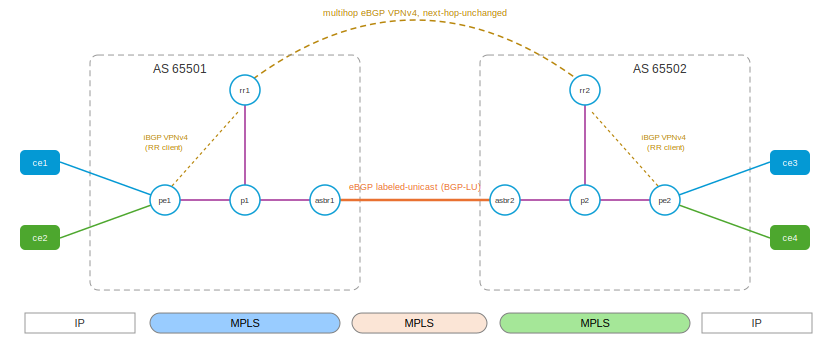

# Inter-AS L3VPN Option C with Route Reflectors — Cisco's reference design

The [direct-PE Option C playset](../interas-option-c/README.md) wires the
two PEs' multihop VPNv4 session straight to each other. That is legitimate
RFC 4364 §10c — but it is not how Cisco's configuration guide (*MPLS VPN
Inter-AS with ASBRs Exchanging IPv4 Routes and MPLS Labels*) draws the
design. Cisco's reference topology puts a **route reflector in each AS**:

> Route reflectors (RRs) exchange VPN-IPv4 routes by using multihop,
> multiprotocol, external Border Gateway Protocol (eBGP). […] Using the
> route reflectors to store the VPN-IPv4 routes and forward them to the
> PE routers results in improved scalability compared with configurations
> where the ASBR holds all of the VPN-IPv4 routes.

This playset builds exactly that: the PEs peer VPNv4 **only with their
local RR**; the RRs peer **multihop eBGP VPNv4 with each other** across
the ASes; and — the design's load-bearing detail — the inter-RR session
runs with **`next-hop-unchanged`**, because the RRs sit *outside* the
forwarding path. A reflected route must keep the originating PE (the true
LSP endpoint) as its next hop, and keep that PE's VPN label; the default
eBGP rewrite-to-self would pull traffic toward a router that does not
forward it. The border ASBRs are unchanged from the direct-PE lab:
labeled loopbacks (BGP-LU) only, zero VPN state.



```
           rr1 ══ multihop eBGP VPNv4, next-hop-unchanged ══ rr2
            │                                                 │
  ce1 ─┐   iBGP VPNv4 (client)                (client) iBGP  │   ┌─ ce3   cust1
       pe1 ─┴─ p1 ── asbr1 ═══ eBGP BGP-LU ═══ asbr2 ── p2 ──┴─ pe2
  ce2 ─┘         AS 65501    (PE + RR loopbacks)  AS 65502       └─ ce4   cust2
```

The data plane is **byte-for-byte the one from the direct-PE lab** — a
three-label stack at ingress, two labels crossing the border, the ASBRs
switching the middle label. Only the control plane changed; the
walkthrough proves both halves.

## Bring up all nodes

``` shell
$ ./up.sh
bring up
...
apply config: ce3
applied
apply config: ce4
applied
```

Twelve namespaces — the ten from the Option A/B/C labs plus `rr1` and
`rr2` (one per AS, attached to the P router, loopbacks `1.1.1.9` /
`2.2.2.9`). Bring up only one Inter-AS lab at a time. Convergence is
layered: IGP → BGP-LU → the inter-RR session (its TCP rides the LU
routes) → VPNv4 — allow a minute.

## The route reflector

`rr1.yaml`'s BGP section carries the whole design:

``` yaml
  bgp:
    global:
      as: 65501
      router-id: 1.1.1.9
    neighbor:
    - remote-address: 1.1.1.1        # PE1 — VPNv4 route-reflector client
      remote-as: 65501
      update-source: 1.1.1.9
      route-reflector:
        client: true
      afi-safi:
      - name: vpnv4
        enabled: true
    - remote-address: 1.1.1.3        # ASBR1 — labeled-unicast only
      remote-as: 65501
      update-source: 1.1.1.9
      afi-safi:
      - name: label-v4
        enabled: true
    - remote-address: 2.2.2.9        # RR2 — multihop eBGP VPNv4
      remote-as: 65502
      ebgp-multihop: 10
      update-source: 1.1.1.9
      afi-safi:
      - name: vpnv4
        enabled: true
        next-hop-unchanged: true     # <- THE RR-based Option C knob
    afi-safi:
    - name: label-v4
      network:
      - prefix: 1.1.1.9/32           # the RR loopback joins BGP-LU too
```

Three things to read out of it:

* **`route-reflector: client: true`** on the PE session — the RR reflects
  between its iBGP clients (with one PE per AS this lab never needs an
  actual iBGP-to-iBGP reflection, but the marking is the Cisco design,
  and adding a second PE would need nothing else).
* **`next-hop-unchanged: true`** on the inter-RR eBGP session. Without
  it, eBGP rewrites the next hop to the advertising RR — a router with
  no VRFs, no customer FIB, and no intention of forwarding. With it, the
  route crosses carrying the originating PE's loopback *and the
  originating PE's VPN label* untouched.
* **The RR loopback is originated into BGP-LU** exactly like a PE
  loopback: RR2 can only establish (and route the TCP of) the multihop
  session if `1.1.1.9/32` is reachable — as a labeled route — from
  inside AS 65502. The ASBRs relay it with the same next-hop-self +
  swap-label machinery as the PE loopbacks; their state grows from two
  loopbacks to four, still zero VPN routes.

In classic Cisco IOS terms:

```
router bgp 65501
 neighbor 1.1.1.1 remote-as 65501           ! PE1
 neighbor 2.2.2.9 remote-as 65502           ! RR2, two IGPs away
 neighbor 2.2.2.9 ebgp-multihop 10
 neighbor 2.2.2.9 update-source Loopback0
 address-family vpnv4
  neighbor 1.1.1.1 activate
  neighbor 1.1.1.1 route-reflector-client
  neighbor 2.2.2.9 activate
  neighbor 2.2.2.9 next-hop-unchanged       ! the knob
```

The PEs shrink accordingly — `pe1.yaml`'s VPNv4 session now points at
`1.1.1.9` (iBGP, local RR) instead of the far PE; it never learns the
other provider exists. The CEs, P routers, and ASBRs are byte-identical
in role to the direct-PE lab (the ASBRs gain one more iBGP-LU neighbor —
the RR).

## Control plane: the RR holds everything, forwards nothing

``` shell
$ sudo ip netns exec rr1 vty
rr1>show bgp summary
...
IPv4 Labeled Unicast Summary:
Neighbor        V         AS   MsgRcvd   MsgSent   TblVer  InQ OutQ  Up/Down State       PfxRcd/Snt Hostname
1.1.1.3         4      65501         5         3        0    0    0 00:00:57 Established        2/1 s

VPNv4 Unicast Summary:
Neighbor        V         AS   MsgRcvd   MsgSent   TblVer  InQ OutQ  Up/Down State       PfxRcd/Snt Hostname
1.1.1.1         4      65501         6         2        0    0    0 00:00:57 Established        4/4 s
2.2.2.9         4      65502         6         2        0    0    0 00:00:54 Established        4/4 s

rr1>show bgp vpnv4
     Network          Next Hop            Metric LocPrf Weight Path
Route Distinguisher: 65501:1
 *>i [1] 10.11.0.0/30       1.1.1.1                  0    100      0 65511 i
     rt:65501:100 label=16,
 *>i [1] 172.16.1.1/32      1.1.1.1                  0    100      0 65511 i
     rt:65501:100 label=16,
Route Distinguisher: 65501:2
 *>i [1] 10.12.0.0/30       1.1.1.1                  0    100      0 65512 i
     rt:65501:200 label=17,
 *>i [1] 172.16.1.1/32      1.1.1.1                  0    100      0 65512 i
     rt:65501:200 label=17,
Route Distinguisher: 65502:1
 *>  [1] 10.13.0.0/30       2.2.2.3                  0             0 65502 65513 i
     rt:65501:100 label=16,
 *>  [1] 172.16.2.1/32      2.2.2.3                  0             0 65502 65513 i
     rt:65501:100 label=16,
Route Distinguisher: 65502:2
 *>  [1] 10.14.0.0/30       2.2.2.3                  0             0 65502 65514 i
     rt:65501:200 label=17,
 *>  [1] 172.16.2.1/32      2.2.2.3                  0             0 65502 65514 i
     rt:65501:200 label=17,
```

The RR holds all eight VPN routes — that is Cisco's point, the VPN state
lives here instead of on the border — but look at the **Next Hop
column: the RR's own address appears nowhere.** The local rows carry PE1
(`1.1.1.1`, iBGP from the client); the far rows arrived over the *eBGP*
session from RR2, yet still carry PE2 (`2.2.2.3`) — that is
`next-hop-unchanged` doing its one job. The labels (`16`/`17`) are the
PEs' per-VRF labels, relayed untouched; nobody along the reflection path
allocated a transit label.

PE1 receives the reflection with nothing rewritten, and resolves the far
PE over BGP-LU exactly as in the direct-PE lab:

``` shell
pe1>show bgp vpnv4
Route Distinguisher: 65502:1
 *>i [1] 10.13.0.0/30       2.2.2.3                  0    100      0 65502 65513 i
     rt:65501:100 label=16,
 *>i [1] 172.16.2.1/32      2.2.2.3                  0    100      0 65502 65513 i
     rt:65501:100 label=16,

pe1>show ip route vrf cust1
...
B  *> 172.16.2.1/32 [200/0] via 10.1.0.2, pe1-p1, label 16013 19 16, 00:01:12
```

The same three-label program — SR transport to ASBR1 (`16013`), ASBR1's
BGP-LU label for PE2's loopback (`19`), PE2's VPN label (`16`). And the
ASBR's whole service footprint is still a handful of loopback swaps, now
four instead of two because the RR loopbacks joined the exchange:

``` shell
asbr1>ip -f mpls route | grep bgp
16 as to 16011 via inet 10.1.0.5 dev asbr1-p1 proto bgp
17 as to 16019 via inet 10.1.0.5 dev asbr1-p1 proto bgp
18 as to 16 via inet 192.168.100.2 dev asbr1-asbr2 proto bgp
19 as to 19 via inet 192.168.100.2 dev asbr1-asbr2 proto bgp
```

(`16`/`17` → the SR labels of PE1 and RR1 inward; `18`/`19` → ASBR2's
labels for PE2 and RR2 outward. Still O(routers), still zero VPN.)

## Data plane: unchanged — and the RRs prove it by silence

``` shell
$ sudo ip netns exec ce1 vty
ce1>ping 172.16.2.1
PING 172.16.2.1 (172.16.2.1) 56(84) bytes of data.
64 bytes from 172.16.2.1: icmp_seq=1 ttl=62 time=0.061 ms
64 bytes from 172.16.2.1: icmp_seq=2 ttl=62 time=0.211 ms
```

Same `ttl=62` as the direct-PE lab. On the border, the same two-label
crossing (ASBR1's `19 as to 19` swap feeding ASBR2, PE2's VPN label
inside):

``` shell
asbr1>tcpdump -nli asbr1-asbr2 mpls
MPLS (label 19, tc 0, ttl 62) (label 16, tc 0, [S], ttl 63) IP 10.11.0.1 > 172.16.2.1: ICMP echo request ...
MPLS (label 16, tc 0, ttl 62) (label 16, tc 0, [S], ttl 63) IP 172.16.2.1 > 10.11.0.1: ICMP echo reply ...
```

And the capture that defines the design — sniffing the RR's only link
**while the ping runs**:

``` shell
rr1>tcpdump -nli rr1-p1 icmp
0 packets captured
```

Not one customer packet. The routers that hold every VPN route forward
none of the VPN traffic; the routers that forward all of it hold none of
the routes. That separation of control and forwarding is what
`next-hop-unchanged` preserves, and why the knob is mandatory here.

## Why Cisco draws it this way

* **The full-mesh problem.** Direct PE-to-PE multihop VPNv4 means every
  PE pair across both providers must peer — N×M sessions crossing the
  boundary, each one inter-provider coordination. With RRs it is
  *exactly one* inter-provider VPNv4 session, total, regardless of PE
  count; new PEs touch only their own AS's RR.
* **VPN state concentrates on two boxes** whose only job is BGP — the
  ASBRs stay lean (Cisco: "improved scalability compared with
  configurations where the ASBR holds all of the VPN-IPv4 routes" —
  i.e., versus Option B), and the PEs hold what they import, as always.
* The cost is the knob this playset exists to demonstrate: an eBGP
  session that must **not** do the most eBGP thing there is. Forgetting
  `next-hop-unchanged` on either RR is the classic Option C lab failure
  — sessions up, routes present, next hop pointing at a router that
  will never forward a customer packet.
* The trust surface is Option C's, unchanged: PE (and now RR) loopbacks
  are reachable as labeled destinations from the neighbor provider —
  which is why this design typically interconnects ASes of the *same*
  operator.

## Tear down

``` shell
$ ./down.sh
```

## Appendix: Addressing & sessions

As the [direct-PE Option C lab](../interas-option-c/README.md#appendix-addressing--sessions),
plus one RR per AS:

| node | role | AS | loopback | SR SID (label) |
|:-----|:-----|:---|:---------|:---------------|
| rr1  | route reflector | 65501 | 1.1.1.9/32 | 19 (16019) |
| rr2  | route reflector | 65502 | 2.2.2.9/32 | 29 (16029) |

New links: p1–rr1 `10.1.0.8/30`, p2–rr2 `10.2.0.8/30`.

BGP sessions: 4× PE-CE eBGP IPv4 (in VRF), 4× iBGP labeled-unicast over
loopbacks (asbr1–{pe1,rr1}, asbr2–{pe2,rr2}; ASBR side `next-hop-self`),
1× ASBR-ASBR eBGP labeled-unicast, 2× iBGP VPNv4 PE–RR (PE as
`route-reflector client`), and 1× **multihop eBGP VPNv4 RR1–RR2 with
`next-hop-unchanged`** — the Cisco-style Option C control plane.

## Sources

* Cisco, *MPLS VPN Inter-AS with ASBRs Exchanging IPv4 Routes and MPLS
  Labels* — the RR-based reference design this lab reproduces, including
  "Configuring the Route Reflectors to Exchange VPN-IPv4 Routes":
  <https://www.cisco.com/c/en/us/td/docs/routers/ios/config/17-x/mpls/b-mpls/m_mp-vpn-connect-ipv4.html>
* RFC 4364, *BGP/MPLS IP Virtual Private Networks*, §10(c) — permits the
  VPN-IPv4 exchange "between route reflectors" with next-hop
  preservation; RFC 4456 (route reflection); RFC 8277 (labeled NLRI).
* netquirks, *Inter-AS Option C* (also RR-based, IOS vs IOS-XR):
  <https://netquirks.co.uk/ios-vs-xr/option-c/>
* QuistED, *Inter-AS MPLS L3VPN Options (A, B, C)*:
  <https://www.quisted.net/index.php/2025/09/12/inter-as-mpls-l3vpn-options-a-b-c/>
* Juniper, *Interprovider VPNs*:
  <https://www.juniper.net/documentation/us/en/software/junos/vpn-l3/topics/topic-map/l3-vpns-interprovider.html>
